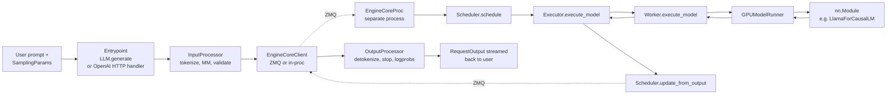
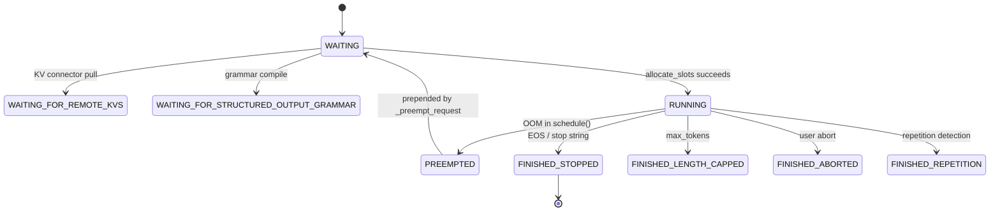
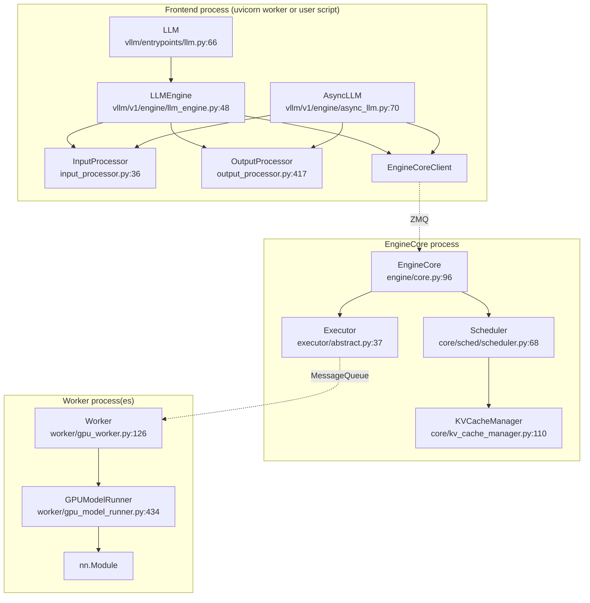

# Day 1 — The Big Picture: Request Lifecycle & Engine Architecture

**By the end of today you will understand:** how a prompt travels from `LLM.generate(...)` or an HTTP `POST /v1/completions` all the way to a GPU kernel and back, what the major V1 objects are (`AsyncLLM`, `EngineCore`, `Scheduler`, `Executor`, `Worker`, `GPUModelRunner`), and where the process boundary sits.

> Time budget: ~55 minutes. Read once, then walk the diagram, then do the exercise.

## 1. The 10,000-foot picture

vLLM ships two engine implementations. Everything under `vllm/v1/` is the current default ("V1"). The legacy engine (`vllm/engine/{llm_engine,async_llm_engine}.py`) is a thin façade left in place for backward compatibility but ultimately constructs V1 components. **Focus your effort on `vllm/v1/`.**

The pipeline for a single generate request:



There are effectively three "layers" you should be able to name at a glance:

| Layer | Lives in process | Talks to |
| --- | --- | --- |
| **Frontend** (user-facing): `LLM`, `AsyncLLM`, `LLMEngine`, HTTP handlers, `InputProcessor`, `OutputProcessor` | Same process as the user's Python code / uvicorn worker | `EngineCoreClient` (over ZMQ) |
| **EngineCore** (scheduling): `EngineCore` / `EngineCoreProc`, `Scheduler`, `Request`, `KVCacheManager` | Its own subprocess (started by `EngineCoreClient.make_async_mp_client`) | `Executor` |
| **Executor + Workers** (execution): `Executor` (`UniProcExecutor` for 1 GPU or `MultiprocExecutor` for TP/PP), `Worker`, `GPUModelRunner`, `nn.Module` | Same process as EngineCore for `Uni`, or one child process per GPU rank for `MP` | Model + KV cache tensors |

That is: **frontend → engine-core → executor** is the request-scheduling axis. **Executor → worker → runner → nn.Module** is the per-step execution axis.

## 2. Entrypoints

### 2a. Offline batch (`LLM.generate`)

```66:80:vllm/entrypoints/llm.py
class LLM(
    OfflineInferenceMixin,
    _OfflineChatMixin,
    _OfflineScoreMixin,
    _OfflineClassifyMixin,
    _OfflineEmbedMixin,
    _OfflineOptionsMixin,
):
    """An LLM for generating texts from given prompts and sampling parameters."""
```

Key symbols:

- `LLM.__init__` at `vllm/entrypoints/llm.py:176` — builds `EngineArgs`, then `self.llm_engine = LLMEngine.from_engine_args(...)`.
- `LLM.generate(...)` at `vllm/entrypoints/llm.py:422` — the entrypoint people actually call. Delegates through `OfflineInferenceMixin._run_completion` → `_add_request` → `self.llm_engine.add_request(...)`.
- The **hot loop** is `_run_engine` at `vllm/entrypoints/offline_utils.py:573`:

```593:596:vllm/entrypoints/offline_utils.py
        while self.llm_engine.has_unfinished_requests():
            step_outputs = self.llm_engine.step()
            for output in step_outputs:
                ...
```

`LLM` wraps a single `LLMEngine`. `LLMEngine.step()` (`vllm/v1/engine/llm_engine.py:296`) is the driver of a single engine iteration.

### 2b. OpenAI-compatible HTTP server

The FastAPI app lives in `vllm/entrypoints/openai/api_server.py`. Key call-sites for the study guide:

- `run_server` at `vllm/entrypoints/openai/api_server.py:679` (CLI entry) and `run_server_worker` at `:695` — construct the async engine and start uvicorn.
- `build_async_engine_client_from_engine_args` at `:108` returns an `AsyncLLM`.
- `POST /v1/completions` route at `vllm/entrypoints/openai/completion/api_router.py:34`; handler `OpenAIServingCompletion.create_completion` at `vllm/entrypoints/openai/completion/serving.py:109`, whose per-prompt engine call is:

```203:203:vllm/entrypoints/openai/completion/serving.py
            generator = self.engine_client.generate(engine_input, sampling_params, ...)
```

- `POST /v1/chat/completions` route at `vllm/entrypoints/openai/chat_completion/api_router.py:40`; handler `OpenAIServingChat.create_chat_completion` at `vllm/entrypoints/openai/chat_completion/serving.py:229`.

Both endpoints ultimately call `AsyncLLM.generate(...)` on the same object that the offline `LLM` proxies through `LLMEngine`.

## 3. The V1 engine core

### 3a. `AsyncLLM` — the async frontend

`vllm/v1/engine/async_llm.py:70` defines the `AsyncLLM(EngineClient)` class. It owns:

- an `InputProcessor` (line 135),
- an `OutputProcessor` (line 138),
- an `EngineCoreClient` built with `make_async_mp_client(...)` (line 146), which spawns the EngineCore subprocess,
- a background asyncio task started by `_run_output_handler()` (line 637) whose body `async def output_handler():` sits at line 656.

The three critical methods:

- `async add_request(...)` at `vllm/v1/engine/async_llm.py:280` — tokenizes/validates via `InputProcessor.process_inputs`, creates a `RequestOutputCollector`, then `_add_request(...)` at `:400`, which does:

```409:412:vllm/v1/engine/async_llm.py
        self.output_processor.add_request(request, prompt, parent_req, index, queue)
        await self.engine_core.add_request_async(request)
```

- `async generate(...)` at `:524` — the API server's per-request generator. It calls `add_request`, then loops on `q.get_nowait()` / `await q.get()` and `yield`s each `RequestOutput`.
- `output_handler()` (line 656) — background task that pulls `EngineCoreOutputs` off the ZMQ socket, feeds them to `OutputProcessor.process_outputs`, and drops each `RequestOutput` into the per-request `RequestOutputCollector`.

### 3b. `LLMEngine` — the sync façade

`vllm/v1/engine/llm_engine.py:48` — a thin synchronous wrapper reachable from offline `LLM.generate`. It also owns `InputProcessor`, `OutputProcessor`, and an `EngineCoreClient` (which may be in-process or subprocess depending on `VLLM_ENABLE_V1_MULTIPROCESSING`).

- `add_request(...)` at `:218` — mirrors `AsyncLLM.add_request` but synchronously.
- `step()` at `:296`:

```304:334:vllm/v1/engine/llm_engine.py
        outputs, model_executed = self.engine_core.get_output()
        processed_outputs = self.output_processor.process_outputs(...)
        ...
        return processed_outputs.request_outputs
```

### 3c. `EngineCore` and `EngineCoreProc` — the scheduling process

`vllm/v1/engine/core.py:96` defines `EngineCore`, which owns `self.model_executor` (an `Executor`) and `self.scheduler` (a `Scheduler`). Its `step()` at `:479` is the heart of the loop:

```490:508:vllm/v1/engine/core.py
        scheduler_output = self.scheduler.schedule(self._should_throttle_prefills())
        future = self.model_executor.execute_model(scheduler_output, non_block=True)
        grammar_output = self.scheduler.get_grammar_bitmask(scheduler_output)
        ...
        model_output = future.result()  # or split into sample_tokens for two-phase
        engine_core_outputs = self.scheduler.update_from_output(
            scheduler_output, model_output)
        return engine_core_outputs, model_executed
```

The subprocess wrapper `EngineCoreProc` (line 896) sits on top of this class:

- `run_busy_loop()` at `:1259` alternates `_process_input_queue()` (drain ZMQ input) and `_process_engine_step()` (call `step_fn()`, push outputs).
- Two IO threads: `process_input_sockets` at `:1484` (deserialize incoming `EngineCoreRequest`s, run `preprocess_add_request` at `:855`, enqueue) and `process_output_sockets` at `:1589` (serialize `EngineCoreOutputs`, ship over ZMQ).
- `DPEngineCoreProc` at `:1745` is the data-parallel variant.

**Why a subprocess?** Two reasons. First, the frontend can keep pushing new HTTP requests into the queue while the engine core is busy running a step. Second, the process boundary lets the model executor use its own signal handlers, its own multiprocessing groups, and its own CUDA context without fighting with the FastAPI event loop.

## 4. From `EngineCore` to the GPU

### 4a. The `Executor` interface

`vllm/v1/executor/abstract.py:37` defines the abstract `Executor`:

- `Executor.get_class(vllm_config)` at `:47` resolves the string `"uni" | "mp" | "ray" | "external_launcher"` (or a qualified class path) into a concrete class.
- `execute_model(scheduler_output, non_block=...)` at `:221` — the sole per-step method `EngineCore` calls. Its default implementation just does `collective_rpc("execute_model", args=(scheduler_output,))`.
- `sample_tokens(...)` at `:241` — used when sampling is deferred (e.g. with structured output bitmasks); returns the `ModelRunnerOutput`.

Two concrete executors matter for now:

**`UniProcExecutor`** — `vllm/v1/executor/uniproc_executor.py:45`. One process, one GPU, no IPC. Just holds a `WorkerWrapperBase` and calls `run_method(self.driver_worker, method, ...)`.

**`MultiprocExecutor`** — `vllm/v1/executor/multiproc_executor.py:103`. Spawns one `WorkerProc` per rank via Python `multiprocessing`. Uses a shared-memory `MessageQueue` to broadcast `(method, args, kwargs, output_rank)`; only the rank at `self.output_rank = _get_output_rank()` (line 495; the first TP worker of the last PP stage) replies with a `ModelRunnerOutput`.

### 4b. The `Worker` and `GPUModelRunner`

`vllm/v1/worker/gpu_worker.py:126` — `class Worker(WorkerBase)`. One instance per GPU rank. Owns a `GPUModelRunner` and (once `initialize_from_config` is called) the KV cache tensors on the device.

- `Worker.execute_model(scheduler_output)` at `:955`. On non-first PP ranks it first receives `intermediate_tensors` from the previous stage via `get_pp_group().irecv_tensor_dict(...)`; on non-last PP ranks it forwards the model's `IntermediateTensors` to the next stage via `isend_tensor_dict(...)`. On the last PP rank it returns a `ModelRunnerOutput`.
- `Worker.sample_tokens(grammar_output)` at `:948`.

`vllm/v1/worker/gpu_model_runner.py:434` — `class GPUModelRunner`. This is the workhorse: it owns the persistent input batch, builds the per-step input tensors, runs the model forward, and samples.

- `_update_states(scheduler_output)` at `:1144` — reconciles the persistent batch with `NewRequestData` + `CachedRequestData`.
- `_prepare_inputs(...)` at `:1906` — builds tokens/positions tensors and returns `(logits_indices, spec_decode_metadata)`.
- `_build_attention_metadata(...)` at `:2233` — one metadata bundle per attention group.
- `execute_model(scheduler_output, intermediate_tensors=None)` at `:4047` — the big forward-pass method (see line-by-line breakdown on Day 4).
- `sample_tokens(grammar_output)` at `:4433` — applies the grammar bitmask, runs `_sample`, then kicks off speculative-decoding draft proposal.

## 5. The data types that flow through

Learn these names. Every downstream discussion refers back to them.

| Type | Where | What it carries |
| --- | --- | --- |
| `PromptType` | `vllm/inputs/__init__.py` | User-facing input: `TextPrompt`, `TokensPrompt`, `EmbedsPrompt`, or multimodal variants. |
| `SamplingParams` | `vllm/sampling_params.py:199` | Temperature, top-p, top-k, n, stop, structured-output constraints, spec-decode knobs, etc. |
| `EngineCoreRequest` | built by `InputProcessor.process_inputs` at `vllm/v1/engine/input_processor.py:242` | Serializable msgspec struct that crosses the ZMQ boundary. |
| `Request` | `vllm/v1/request.py:59` (built via `Request.from_engine_core_request` at `:198`) | The scheduler-side state machine (WAITING → RUNNING → FINISHED_*). Owns `block_hashes`, `num_computed_tokens`, `spec_token_ids`. |
| `SchedulerOutput` | `vllm/v1/core/sched/output.py:181` | What the scheduler hands to the executor: `scheduled_new_reqs`, `scheduled_cached_reqs`, `num_scheduled_tokens`, `scheduled_spec_decode_tokens`, KV-connector metadata, etc. |
| `ModelRunnerOutput` | `vllm/v1/outputs.py:234` | What the worker returns: `sampled_token_ids`, `logprobs`, `pooler_output`, `num_nans_in_logits`, KV-connector output. |
| `EngineCoreOutputs` | pushed by `Scheduler.update_from_output` | Per-request `EngineCoreOutput` list plus stats; crosses ZMQ back to frontend. |
| `RequestOutput` | `vllm/outputs.py` (imported via `from vllm.outputs`) | What the user actually gets back. |

`Request` transitions (statuses at `vllm/v1/request.py:323`):



## 6. Component diagram, annotated



## 7. Where each concept lives (quick reference)

```
Big picture:              docs/design/arch_overview.md
                          docs/usage/v1_guide.md

Frontend:                 vllm/entrypoints/llm.py
                          vllm/entrypoints/openai/api_server.py
                          vllm/entrypoints/openai/{completion,chat_completion}/{api_router,serving}.py

Engine:                   vllm/v1/engine/{llm_engine,async_llm,core,input_processor,output_processor}.py
                          vllm/v1/request.py

Scheduler:                vllm/v1/core/sched/{scheduler,async_scheduler,output,request_queue,interface,utils}.py

Executor:                 vllm/v1/executor/{abstract,uniproc_executor,multiproc_executor}.py

Worker:                   vllm/v1/worker/{gpu_worker,gpu_model_runner}.py

Outputs & sampling:       vllm/v1/outputs.py
                          vllm/sampling_params.py
```

## 8. Comprehension checks

1. In V1, which process owns the `Scheduler`? Which process owns the `nn.Module`? Under what setup (`--distributed-executor-backend`?) are they in the same process?
2. What is the difference between `EngineCoreRequest` and `Request`? Why does the engine need both?
3. Trace what happens when `AsyncLLM.generate` yields its first `RequestOutput`: which method built that object, and where did the token IDs actually come from?
4. If `EngineCore.step` calls `execute_model(non_block=True)`, why does it work even when the executor is a `UniProcExecutor` running in the same process? (Hint: read `UniProcExecutor.collective_rpc` at `vllm/v1/executor/uniproc_executor.py:79`.)
5. What does the `output_rank` in `MultiprocExecutor` do, and why is it not the same as rank 0?

## 9. Hands-on exercise

Open `vllm/v1/engine/core.py:479` (`EngineCore.step`) and read the entire method. Then open `vllm/v1/executor/uniproc_executor.py:79` (`UniProcExecutor.collective_rpc`) and `vllm/v1/worker/gpu_worker.py:955` (`Worker.execute_model`). Predict what happens in this sequence, in single-GPU mode:

1. `EngineCore.step` is called.
2. `scheduler.schedule()` returns a `SchedulerOutput`.
3. `model_executor.execute_model(scheduler_output, non_block=True)` is called.
4. That triggers `Worker.execute_model(scheduler_output)`.

Which of these run on the same Python thread? Which release the GIL? Where does the CUDA stream synchronize?

Now verify your prediction by finding the `return output.result()` at `vllm/v1/engine/core.py:497` and reading `AsyncOutputFuture` at `vllm/v1/executor/uniproc_executor.py:26`.

Tomorrow (Day 2) we descend into what actually gets called at step (4): the `nn.Module`.
