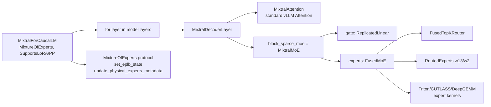
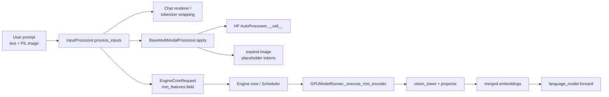
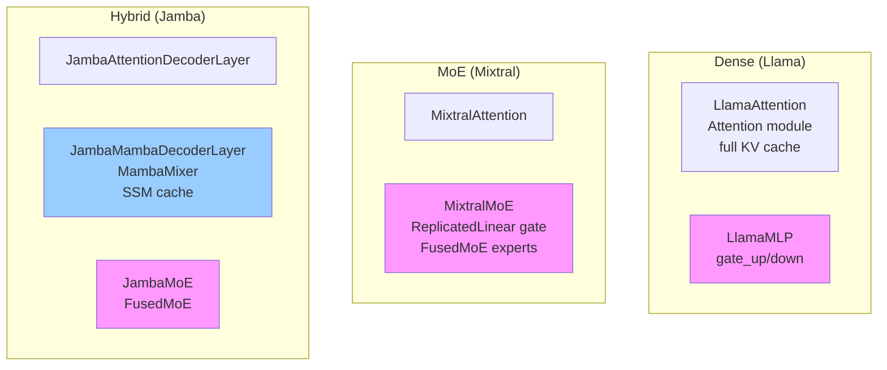

# Day 3 — MoE, Multimodal, and Hybrid (Non-Transformer) Architectures

**By the end of today you will understand:** how a mixture-of-experts model differs from a dense one in vLLM (`FusedMoE`, expert parallelism, `MixtureOfExperts` protocol), how a vision-language model plugs its multimodal processor into the input pipeline (`MULTIMODAL_REGISTRY`, `embed_multimodal`), and how a state-space model like Mamba (or a hybrid like Jamba) replaces attention with an SSM layer and uses its own KV cache spec.

> Time budget: ~55 minutes.

Prereq: Day 2 (Llama walkthrough and the layer library).

## 1. MoE: `vllm/model_executor/models/mixtral.py`

Mixtral is the canonical worked example. Non-shared expert MoE (top-K routing, no shared experts).

### 1a. The MoE layer

```71:149:vllm/model_executor/models/mixtral.py
class MixtralMoE(nn.Module):
    def __init__(self, num_experts, top_k, hidden_size, intermediate_size,
                 params_dtype=None, quant_config=None, tp_size=None, dp_size=None,
                 prefix="", enable_eplb=False):
        super().__init__()
        ...
        # EP setup (get_ep_group, rank, size, redundant experts) at 96-113
        self.gate = ReplicatedLinear(
            hidden_size, num_experts, bias=False,
            quant_config=None, prefix=f"{prefix}.gate")               # line 117
        self.experts = FusedMoE(
            num_experts=..., top_k=..., hidden_size=...,
            intermediate_size=..., renormalize=True,
            quant_config=..., tp_size=..., dp_size=...,
            prefix=f"{prefix}.experts",
            enable_eplb=..., num_redundant_experts=...,
            ckpt_names=("w1", "w2", "w3"))                            # line 126

    def forward(self, hidden_states):
        router_logits, _ = self.gate(hidden_states)
        final = self.experts(hidden_states, router_logits)
        return final
```

Two key building blocks:

1. **`ReplicatedLinear` router** (line 117). Every TP rank runs the full router matmul locally — no communication needed for the `hidden_size → num_experts` projection. Runs in the request's activation dtype (fp16/bf16); MoE-quant configs never quantize the router.

2. **`FusedMoE`** (`vllm/model_executor/layers/fused_moe/layer.py:100`) — actually a **factory function** despite the name. It returns a `MoERunner` (`fused_moe/runner/moe_runner.py:221`). Inside, it composes:
   - `FusedMoERouter` (e.g. `FusedTopKRouter`, `FusedTopKBiasRouter`, `GroupedTopKRouter`) — chooses top-K experts per token and their weights.
   - `RoutedExperts` (`fused_moe/routed_experts.py:44`) — holds the per-expert weights (`w13` up-proj, `w2` down-proj), sharded either by TP or EP.
   - An expert-kernel implementation (`TritonExperts`, `CutlassExpertsFp8`, `DeepGemmExperts`, `AiterExperts`, etc.) — the actual grouped-GEMM.
   - Optional shared experts (`n_shared_experts`, used by DeepSeek).

### 1b. `MixtralForCausalLM` implements `MixtureOfExperts`

`mixtral.py:376`:



The `MixtureOfExperts` protocol is at `vllm/model_executor/models/interfaces.py:846`. It exposes:

- Bookkeeping attrs the EPLB (Expert-Parallel Load Balancer) reads: `num_moe_layers`, `num_logical_experts`, `num_physical_experts`, `num_local_physical_experts`, `num_routed_experts`, `num_shared_experts`, `num_redundant_experts`, `num_expert_groups`, `expert_weights`, `moe_layers`.
- Methods vLLM calls at runtime: `set_eplb_state(state)` (line 887) and `update_physical_experts_metadata(num_physical, num_local)` (line 920).

`MixtralForCausalLM.__init__` populates these attrs inside a loop at `mixtral.py:420-444` by collecting all `layer.block_sparse_moe.experts` into `self.moe_layers`. Load balancer code:

- `vllm/distributed/eplb/eplb_state.py:219` — `EplbState` class.
- `docs/design/dbo.md` (Dual Batch Overlap) — for MoE deployments that combine EP with DP and overlap all-to-all with compute.

### 1c. Weight loading for MoE

MoE experts are stored per-expert in HF (`experts.0.w1.weight`, `experts.1.w1.weight`, ...). vLLM stacks them into a single tensor per shard. The helper at `vllm/model_executor/layers/fused_moe/layer.py:409` — `fused_moe_make_expert_params_mapping` — produces the translation table.

You will see MoE model `load_weights` methods (`mixtral.py:371-373`) call `AutoWeightsLoader` similar to LLaMA, plus separate handling for expert params:

- Each expert weight receives a `weight_loader` closure that writes into a specific expert slice.
- If EPLB is enabled, only the experts assigned to this rank are loaded; other rows stay zero.

Doc references:

- `docs/design/fused_moe_modular_kernel.md` — how `Prepare / Compute / Finalize` compose orthogonally.
- `docs/design/moe_kernel_features.md` — the compatibility matrix (Contiguous vs Batched, all-to-all backends, quant support, DBO compatibility).

## 2. Multimodal: `vllm/model_executor/models/llava.py`

### 2a. Registry hook

The magic starts with a class-level decorator:

```497:509:vllm/model_executor/models/llava.py
@MULTIMODAL_REGISTRY.register_processor(
    _build_llava_or_pixtral_hf_processor,
    info=_build_llava_or_pixtral_hf_info,
    dummy_inputs=LlavaDummyInputsBuilder,
)
class LlavaForConditionalGeneration(
        nn.Module, SupportsLoRA, SupportsMultiModal, SupportsPP,
        SupportsEagle, SupportsEagle3):
```

`MULTIMODAL_REGISTRY.register_processor` (`vllm/multimodal/registry.py:142`) sets `model_cls._processor_factory = _ProcessorFactories(info, dummy_inputs, processor)`. The `_ProcessorFactories` dataclass is defined at `registry.py:81` and its `build_processor(ctx, cache=None)` at `:87` is called by the input processor.

Three things every multimodal model provides:

| Callable | Purpose |
| --- | --- |
| `info` (`BaseProcessingInfo`) | Reads model config + tokenizer, tells the engine how many tokens each image expands to. |
| `processor` (`BaseMultiModalProcessor`) | The main pre-processor: resizes images, tokenizes text, expands `<image>` placeholders. |
| `dummy_inputs` (`BaseDummyInputsBuilder`) | Generates fake pixel + token inputs for profiling and memory sizing. |

The `LlavaMultiModalProcessor` inherits `BaseMultiModalProcessor` (`vllm/multimodal/processing/processor.py:972`).

### 2b. The vision tower + projector + language model

```560:581:vllm/model_executor/models/llava.py
with self._mark_tower_model(vllm_config, "image"):
    self.vision_tower = init_vision_tower_for_llava(
        config, quant_config,
        require_post_norm=False,
        prefix=maybe_prefix(prefix, "vision_tower"))
    self.multi_modal_projector = LlavaMultiModalProjector(
        vision_hidden_size=config.vision_config.hidden_size,
        text_hidden_size=config.text_config.hidden_size,
        projector_hidden_act=config.projector_hidden_act,
        multimodal_projector_bias=..., quant_config=quant_config,
        prefix=maybe_prefix(prefix, "multi_modal_projector"))

with self._mark_language_model(vllm_config):
    self.language_model = init_vllm_registered_model(
        vllm_config=vllm_config,
        hf_config=config.text_config,
        prefix=maybe_prefix(prefix, "language_model"))
```

Note two things:

1. `init_vision_tower_for_llava` at `llava.py:456` dispatches on `vision_config` type to `CLIPVisionModel` / `SiglipVisionModel` / `PixtralHFVisionModel`.
2. The language model is loaded **recursively through the registry** with `init_vllm_registered_model(...)`. For LLaVA-1.5 that's LLaMA; for LLaVA-Next-video that's Vicuna; for Pixtral that's Mistral. The `_mark_language_model` / `_mark_tower_model` context managers annotate submodule prefixes so the LoRA loader knows which parts belong to the "language model" vs "vision tower".

### 2c. The multimodal forward: `embed_multimodal`

```659:664:vllm/model_executor/models/llava.py
def embed_multimodal(self, **kwargs) -> MultiModalEmbeddings:
    image_input = self._parse_and_validate_image_input(**kwargs)
    vision_embeddings = self._process_image_input(image_input)
    return vision_embeddings
```

`SupportsMultiModal.embed_multimodal(**kwargs)` is the mixin contract at `vllm/model_executor/models/interfaces.py:153`. It returns projected image (or audio, or video) embeddings. The framework then merges these into the text-token embedding tensor via `embed_input_ids` — the `<image>` placeholder tokens are replaced by the corresponding rows from `vision_embeddings`. The important detail:

> The input processor pre-expands each `<image>` placeholder into N tokens (e.g. 576 for LLaVA-1.5) so KV-cache position indices stay aligned with what the LLM sees.

The rest of `LlavaForConditionalGeneration.forward` (`:666`) is a passthrough to `self.language_model.model(...)`. The language model does not know it's serving a VLM.

### 2d. Multimodal input pipeline



Docs:

- `docs/design/mm_processing.md` — the definitive design for `BaseMultiModalProcessor`.
- `docs/features/multimodal_inputs.md` — user-facing usage.
- `docs/contributing/model/multimodal.md` — how to add a new VLM.

### 2e. Vision-tower CUDA graphs

Some VLMs (`SupportsEncoderCudaGraph` at `interfaces.py:1547`) capture their vision encoder into CUDA graphs. The runner side lives in `vllm/v1/worker/encoder_cudagraph.py`. Details in `docs/design/cuda_graphs_multimodal.md`.

## 3. Hybrid / non-transformer: Mamba and Jamba

### 3a. Pure SSM: `vllm/model_executor/models/mamba.py`

Mamba has no attention. It replaces the attention block with a state-space model layer:

```48:97:vllm/model_executor/models/mamba.py
class MambaDecoderLayer(nn.Module):
    def __init__(self, config, cache_config, quant_config, prefix=""):
        super().__init__()
        self.mixer = MambaMixer(
            hidden_size=..., ssm_state_size=..., conv_kernel_size=...,
            intermediate_size=..., time_step_rank=...,
            use_conv_bias=..., use_bias=..., use_rms_norm=self.is_falcon_mamba,
            ...,
            prefix=f"{prefix}.mixer")
        self.norm = RMSNorm(config.hidden_size, eps=config.layer_norm_epsilon)
    def forward(self, hidden_states, output):
        hidden_states = self.norm(hidden_states)
        return self.mixer(hidden_states, output)
```

`MambaMixer` (`vllm/model_executor/layers/mamba/mamba_mixer.py:51`) wraps four Triton kernels:

- `causal_conv1d_fn` / `causal_conv1d_update` — the 1D depthwise conv.
- `selective_scan_fn` — the SSM recurrence (prefill).
- `selective_state_update` — SSM step (decode).

Just like `Attention`, the mixer looks up its metadata from the forward context. There is no `attn_cache` argument; instead, `Mamba1AttentionMetadata` (from `vllm/v1/attention/backends/mamba1_attn.py:29`) supplies conv/temporal state block indices and per-request seq lens.

### 3b. `MambaForCausalLM` implements `HasInnerState`, `IsAttentionFree`, `SupportsMambaPrefixCaching`

`mamba.py:173`:

```223:251:vllm/model_executor/models/mamba.py
    @classmethod
    def get_mamba_state_dtype_from_config(cls, vllm_config):
        return MambaStateDtypeCalculator.mamba1_state_dtype(...)

    @classmethod
    def get_mamba_state_shape_from_config(cls, vllm_config):
        return MambaStateShapeCalculator.mamba1_state_shape(...)

    @classmethod
    def get_mamba_state_copy_func(cls):
        ...
```

These class methods let the KV-cache manager pre-compute how many "blocks" of conv-state and temporal-state to allocate per request. The KV cache system supports SSM state via the `MambaSpec` (`vllm/v1/kv_cache_interface.py:668`) and `MambaManager` (`vllm/v1/core/single_type_kv_cache_manager.py:1026`).

Only the last state per prefix is kept for prefix caching — a Mamba prefix hit returns a single "cached" block with all prior positions filled by null blocks. This is because SSM state summarizes the entire history in one vector.

### 3c. Hybrid: `vllm/model_executor/models/jamba.py`

Jamba interleaves attention layers with Mamba layers. The dispatch table:

```299:302:vllm/model_executor/models/jamba.py
ALL_DECODER_LAYER_TYPES = {
    "attention": JambaAttentionDecoderLayer,
    "mamba": JambaMambaDecoderLayer,
}
```

Then in `JambaModel.__init__` it uses `ALL_DECODER_LAYER_TYPES[config.layers_block_type[i]]` per index. `JambaForCausalLM` implements `IsHybrid`, `HasInnerState`, `MixtureOfExperts`, `SupportsPP`, `SupportsLoRA`. Its `get_mamba_state_shape_from_config` returns **hybrid** shapes (conv+temporal) so the KV manager can size both an attention and an SSM group.

### 3d. What "hybrid KV cache" means

Because attention layers need one kind of KV cache and SSM layers need another, vLLM's `KVCacheCoordinator` splits layers into groups, each with its own spec:

- `FullAttentionSpec` (`vllm/v1/kv_cache_interface.py:205`) — for attention layers.
- `MambaSpec` (`:668`) — for SSM layers.

The `HybridKVCacheCoordinator` (`vllm/v1/core/kv_cache_coordinator.py:514`) coordinates them. Day 4 dives into this.

Docs:

- `docs/design/hybrid_kv_cache_manager.md`.

## 4. Cross-cutting: `SupportsQuant`

`SupportsQuant` (`vllm/model_executor/models/interfaces.py:999`) is a concrete base class, not a Protocol. Its `__new__` walks the class hierarchy at construction time to find `packed_modules_mapping` and `hf_to_vllm_mapper`, then applies those to the quantization config so quant methods correctly identify fused modules. Any new model that supports quantization should extend it.

## 5. Diagram: three model families side by side



Key differences:

- **Dense**: standard `Attention` + dense `MLP`. One KV cache group.
- **MoE**: standard `Attention` + `FusedMoE` MLP. Still one KV cache group. Implements `MixtureOfExperts` for EPLB.
- **Hybrid**: some layers are attention, some are Mamba, some may have MoE MLPs. **Multiple KV cache groups.** Implements `IsHybrid`, `HasInnerState`, and possibly `MixtureOfExperts`.

## 6. Comprehension checks

1. What is the difference between the router (`self.gate`) and the experts (`self.experts`) in `MixtralMoE`? Why is the router `ReplicatedLinear` and not `ColumnParallelLinear`?
2. When you serve `mistralai/Mixtral-8x7B-Instruct-v0.1` with TP=2 and EP=4, how many logical experts are on each rank? Where does that get computed? (Hint: read `determine_expert_counts` at `fused_moe/layer.py:73`.)
3. In `LlavaForConditionalGeneration`, why is `_mark_language_model` a context manager and not just a flag? What does it need to track? (Hint: the LoRA loader.)
4. If you called `LLM.generate(...)` on a LLaVA model with `image=None`, what would happen inside `embed_multimodal`? Trace `_parse_and_validate_image_input` at `llava.py:587`.
5. In Mamba, what is the analog of the "KV block table"? Where in the code is it accessed? (Hint: `Mamba1AttentionMetadata`.)

## 7. Hands-on exercise

Open `vllm/model_executor/models/mixtral.py:376` (`MixtralForCausalLM.__init__`). Predict:

1. If you configured `--enable-expert-parallel` with EP=4 for an 8-expert model, how many experts land on each rank?
2. What happens in the `for layer in self.model.layers: layer.block_sparse_moe.experts` loop at lines 420-444 that populates the `MixtureOfExperts` bookkeeping?
3. What would `update_physical_experts_metadata` at line 446 do if the EPLB moved expert 2 from rank 0 to rank 3?

Verify by reading:
- `vllm/model_executor/layers/fused_moe/layer.py:73` (`determine_expert_counts`).
- `vllm/distributed/eplb/eplb_state.py:721` (`EplbState.rearrange`).

Bonus: skim `docs/design/mm_processing.md` — the whole document is ~1000 lines but the "Placeholder Expansion" section explains why VLMs need to bake image-token counts into the prompt.

Tomorrow (Day 4) descends into how the KV cache actually works.
