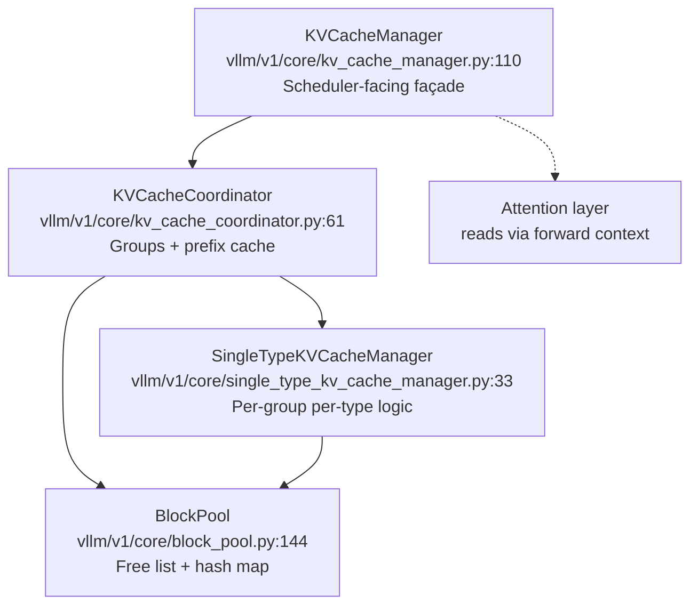
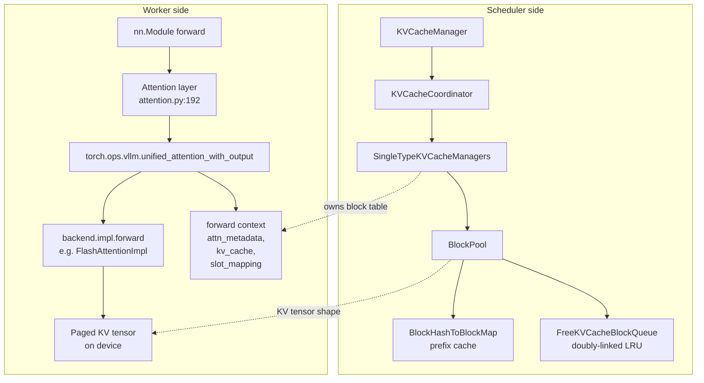

# Day 4 — KV Cache Management and PagedAttention

**By the end of today you will understand:** what "PagedAttention" means concretely in the V1 codebase, the layered structure of the KV cache manager (`KVCacheManager` → `KVCacheCoordinator` → `SingleTypeKVCacheManager` → `BlockPool`), how attention layers reach the KV cache through the forward context and the `unified_attention_with_output` custom op, and how attention backends (FlashAttention, Triton, FlashInfer, MLA) plug in.

> Time budget: ~60 minutes.

Prereq: Day 1 (engine flow), Day 3 (hybrid models).

## 1. What "PagedAttention" is (and isn't) in V1

The **name** "PagedAttention" was introduced in the original vLLM paper (Kwon et al., SOSP 2023) and referred to a specific CUDA kernel that reads KV blocks through an indirection ("block table"). That kernel still exists (`csrc/attention/paged_attention_v1.cu`, described in `docs/design/paged_attention.md`) but modern V1 does **not** call it directly. Instead:

- The **block-table abstraction** — a per-request array of physical block IDs, so the KV cache is a jumbled pool of fixed-size blocks rather than one contiguous tensor per request — is what everyone still calls PagedAttention today. That abstraction lives in the V1 `BlockPool` and per-request block tables, and every modern attention backend (FlashAttention, Triton, FlashInfer, MLA) implements block-indirected reads natively.

So when you hear "PagedAttention" in 2026-era vLLM, think **"paged KV cache abstraction"**, not "the original kernel".

## 2. The KV cache layering

Four levels of abstraction. Memorize the vocabulary.



- **`KVCacheManager`** — the scheduler talks to only this class.
- **`KVCacheCoordinator`** — knows about groups; picks the right per-type manager.
- **`SingleTypeKVCacheManager`** — subclasses per KV-cache flavor: `FullAttentionManager`, `SlidingWindowManager`, `ChunkedLocalAttentionManager`, `MambaManager`, `CrossAttentionManager`, `RSWAManager`, `SinkFullAttentionManager`.
- **`BlockPool`** — the ONLY thing that touches the free-list and the prefix-cache hash map.

### 2a. `KVCacheManager` — the scheduler façade

`vllm/v1/core/kv_cache_manager.py:110`. Key methods:

- `get_computed_blocks(request)` at `:202` — **prefix cache hit lookup**. Calls `coordinator.find_longest_cache_hit(request.block_hashes, ...)`. Caps the hit at `num_tokens - 1` (so the last token is never a hit — we always run at least one forward pass to sample).
- `allocate_slots(request, num_new_tokens, ...)` at `:244` — **the big one**. Three-stage allocation:
  1. Free skipped blocks (sliding window / R-SWA / mamba-align).
  2. Allocate for external computed tokens (KV connector pulls).
  3. Allocate for new + lookahead tokens.
  Then calls `coordinator.cache_blocks` (unless caching is disabled or `delay_cache_blocks=True` for P/D).
- `free(request_id)` at `:462` — releases blocks (decrements refcounts).
- `remove_skipped_blocks(...)` at `:472` — evicts blocks outside the sliding window.
- `get_num_common_prefix_blocks(...)` at `:528` — per-group count of blocks shared by all running requests (used by cascade attention).
- `take_events()` at `:562` — drains `BlockStored`/`BlockRemoved` events for KV-events consumers.
- `reset_prefix_cache()` at `:512` — wipes the prefix cache (used for RLHF weight updates and benchmark reset).

### 2b. `KVCacheCoordinator` — multi-group orchestration

`vllm/v1/core/kv_cache_coordinator.py:61`. Two concrete forms:

- **`UnitaryKVCacheCoordinator`** (`:427`) — one group. Trivial: forwards to the single `SingleTypeKVCacheManager`.
- **`HybridKVCacheCoordinator`** (`:514`) — multiple groups (hybrid Mamba+attention, SWA+full attention, DeepSeek V4 SWA-MLA).

For hybrid, `find_longest_cache_hit` (line 630) runs an iterative fixed-point across groups: each type either accepts the current candidate hit length or shrinks it. Full attention is scanned first (its scan gives the tightest initial bound). EAGLE-drop is applied at most once per candidate. The loop terminates because length is monotonically non-increasing.

Factory: `get_kv_cache_coordinator` at `:782` picks `NoPrefixCache` / `Unitary` / `Hybrid`.

### 2c. `SingleTypeKVCacheManager` subclasses

`vllm/v1/core/single_type_kv_cache_manager.py`:

| Class | Line | For |
| --- | --- | --- |
| `FullAttentionManager` | 564 | Full attention, MLA, chunked-local, TQ |
| `RSWAManager(FullAttentionManager)` | 625 | Reference sliding-window attention |
| `SlidingWindowManager` | 669 | Sliding window |
| `ChunkedLocalAttentionManager` | 876 | LLaMA 4 chunked local attention |
| `MambaManager` | 1026 | Mamba SSM state |
| `CrossAttentionManager` | 1368 | Encoder-decoder cross attn |
| `SinkFullAttentionManager` | 1431 | Attention sink |

The registry that maps `KVCacheSpec` → manager class is `KVCacheSpecRegistry` (`vllm/v1/kv_cache_spec_registry.py:39`), populated by `register_all_kvcache_specs` (`single_type_kv_cache_manager.py:1499`).

### 2d. `BlockPool` — the free list

`vllm/v1/core/block_pool.py:144`. Two data structures:

1. **`FreeKVCacheBlockQueue`** (`kv_cache_utils.py:179`) — a doubly-linked list of free blocks. Doubly linked because `remove` in the middle is O(1) (the linked-list version of an LRU cache). Blocks live in one big `KVCacheBlock` array indexed by `block_id`.

2. **`BlockHashToBlockMap`** (`block_pool.py:34`) — the prefix-cache index. Maps `BlockHashWithGroupId → KVCacheBlock` (or `dict[block_id, KVCacheBlock]` when duplicate blocks share a hash).

Key methods:

- `get_new_blocks(num_blocks, reserved_blocks)` at `:542` — pop from free queue, invalidate any prefix-cache entry pointing at the block (via `_maybe_evict_cached_block` at `:574`), bump `ref_cnt` to 1.
- `touch(blocks)` at `:597` — bump `ref_cnt` for reused prefix-cache blocks; remove them from the free queue.
- `free_blocks(blocks)` at `:614` — decrement `ref_cnt`. Blocks that hit zero go back to the free queue. **Hashed blocks append to the tail** (LRU eviction order). **Unhashed blocks prepend to the head** (evict first, they have no reuse value).
- `cache_full_blocks(...)` at `:226` — the **prefix cache write path**. Iterates the request's `blocks[num_cached:num_full]`, tags each with a `BlockHashWithGroupId`, emits a `BlockStored` event.

## 3. KV cache specs and configs

`vllm/v1/kv_cache_interface.py`:

- `KVCacheSpec` (line 99) — abstract base. Fields: `block_size`, `page_size_bytes`, `max_memory_usage_bytes`.
- `AttentionSpec(KVCacheSpec)` (line 163) — adds `num_kv_heads`, `head_size`, `dtype`, `kv_quant_mode`.
- `FullAttentionSpec(AttentionSpec)` (line 205) — the default.
- `MLAAttentionSpec(FullAttentionSpec)` (line 362) — DeepSeek MLA (compressed KV).
- `SlidingWindowSpec(AttentionSpec)` (line 517) — Mistral-style SWA.
- `ChunkedLocalAttentionSpec(AttentionSpec)` (line 480) — LLaMA 4 local attention.
- `MambaSpec(KVCacheSpec)` (line 668) — arbitrary state shapes, `mamba_type`, `mamba_cache_mode`.
- `KVCacheGroupSpec` (line 904) — a bundle `(layer_names, kv_cache_spec, is_eagle_group)`.
- `KVCacheConfig` (line 919) — the top-level object: `(num_blocks, kv_cache_tensors, kv_cache_groups)`.

The `KVCacheConfig` is built at engine startup by `get_kv_cache_configs` (`vllm/v1/core/kv_cache_utils.py:2005`), which:
1. Asks each `Attention` module in the model for its `KVCacheSpec` (via `Attention.get_kv_cache_spec` at `attention.py:583`).
2. Groups layers by identical spec.
3. Computes `num_blocks` from available GPU memory (respecting `--gpu-memory-utilization`).
4. May shrink `max_model_len` if the requested value doesn't fit.

## 4. Prefix caching, in detail

The block hash function is at `vllm/v1/core/kv_cache_utils.py:577`:

```577:590:vllm/v1/core/kv_cache_utils.py
def hash_block_tokens(
    hash_function: Callable[[Any], int],
    parent_block_hash: int | None,
    curr_block_token_ids: Sequence[int],
    extra_keys: tuple[Any, ...] | None = None,
) -> int:
    if not parent_block_hash:
        parent_block_hash = NONE_HASH  # see :95-116 for seeding
    return hash_function(
        (parent_block_hash, tuple(curr_block_token_ids), extra_keys))
```

A block's hash is `hash(parent_hash, this_block_tokens, extra_keys)`. The chain rooted at `NONE_HASH` means the first block's parent is deterministic (seeded from `PYTHONHASHSEED` or `os.urandom`).

The `extra_keys` capture cache-poisoning factors: multimodal identifiers, LoRA adapter ids, cache-salt strings, prompt-embed identifiers. `generate_block_hash_extra_keys` at `:539` collects them.

`get_request_block_hasher` at `:673` returns a closure that appends new block hashes to `request.block_hashes` as tokens grow.

### 4a. Where prefix caching is used

- **Lookup**: `Scheduler.schedule` (waiting-phase) calls `self.kv_cache_manager.get_computed_blocks(request)` at `vllm/v1/core/sched/scheduler.py:719` for a fresh request.
- **Write**: `KVCacheManager.allocate_slots` → `coordinator.cache_blocks` → per-manager `cache_blocks` → `BlockPool.cache_full_blocks`.
- **Eviction**: `BlockPool.free_blocks` puts hashed blocks on the tail, so the next `get_new_blocks` evicts the least-recently-used cached block first.

Doc: `docs/design/prefix_caching.md`. User guide: `docs/features/automatic_prefix_caching.md`.

### 4b. Sliding-window and Mamba-specific quirks

- SWA / RSWA / chunked-local managers implement `reachable_block_mask` (SW: `single_type_kv_cache_manager.py:774`; Mamba: `:1089`) that tells the block pool "these blocks are unreachable in this request's attention pattern, don't cache them".
- Mamba is single-block per prefix (the SSM state summarizes all history), so `MambaManager.find_longest_cache_hit` at `:1041` scans right-to-left and requires only one matching block.

## 5. The `Attention` module and the `unified_attention` custom op

The critical file: `vllm/model_executor/layers/attention/attention.py`.

### 5a. `Attention.__init__`

`attention.py:204` — sets up the KV cache scheme, chooses a backend via `get_attn_backend(...)` (line 319), and builds `self.impl = impl_cls(...)` at line 388. It also does two things you'll come back to:

```413:427:vllm/model_executor/layers/attention/attention.py
        # Register in the forward context so custom ops can find us by layer_name.
        vllm_config.compilation_config.static_forward_context[prefix] = self
        ...
        # Placeholder that gets replaced by bind_kv_cache at initialize_from_config.
        self.kv_cache = torch.tensor([])
```

`bind_kv_cache` (called from `Worker.initialize_from_config`) later assigns the real KV tensor into `self.kv_cache` for this layer.

### 5b. `Attention.forward`

`attention.py:452`. The interesting sequence:

```507:545:vllm/model_executor/layers/attention/attention.py
        if not use_direct_call:  # not opaque platform
            output = torch.empty(...)
            _ = torch.ops.vllm.unified_kv_cache_update(key, value, layer_name)
            torch.ops.vllm.unified_attention_with_output(
                query, key, value, output, layer_name,
                output_scale, output_block_scale,
                kv_cache_dummy_dep)
            return output
        ...
```

Two custom ops are involved:

1. `torch.ops.vllm.unified_kv_cache_update` — writes new K/V into the paged KV cache. Only invoked when the backend has `forward_includes_kv_cache_update = False` (e.g. FlashAttention, Triton, FlashInfer). Its return value is a dummy tensor whose only purpose is to give the compiled graph a data dependency so the KV write is ordered before attention.

2. `torch.ops.vllm.unified_attention_with_output` — **this is the main custom op**. Registered at `attention.py:802`. Its body (`unified_attention_with_output` at line 759) does:

```759:788:vllm/model_executor/layers/attention/attention.py
@eager_break_during_capture
@maybe_transfer_kv_layer
def unified_attention_with_output(query, key, value, output, layer_name, ...):
    attn_metadata, attn_layer, kv_cache, slot_mapping = get_attention_context(layer_name)
    self = attn_layer
    self.impl.forward(
        self, query, key, value, kv_cache, attn_metadata,
        output=output, output_scale=output_scale,
        output_block_scale=output_block_scale)
```

`get_attention_context(layer_name)` (at `attention.py:672`) pulls the KV cache, the slot mapping, and the attention metadata for this layer out of the forward context. **The custom op does NOT take the KV cache as a tensor argument** — it uses `layer_name` as an opaque handle. This keeps compiled graphs free of large tensor arguments.

MLA has parallel ops: `torch.ops.vllm.unified_mla_kv_cache_update` and `torch.ops.vllm.unified_mla_attention_with_output` registered in `vllm/model_executor/layers/attention/mla_attention.py`.

### 5c. Forward context

The forward context is a per-step object set up by `set_forward_context(...)` (called from `GPUModelRunner.execute_model` around line 4312). It carries:

- `attn_metadata` — per-layer `AttentionMetadata` (or a dict / list-of-dicts for spec decode).
- `no_compile_layers[layer_name].kv_cache` — the paged KV tensor for this layer.
- `slot_mapping[layer_name]` — the per-token block-slot indices.

## 6. Attention backends

### 6a. The abstract interface

`vllm/v1/attention/backend.py`:

- `AttentionBackend(ABC)` at `:55` — abstract methods `get_name`, `get_impl_cls`, `get_builder_cls`, `get_kv_cache_shape`. Class attrs: `supported_dtypes`, `supported_kv_cache_dtypes`, `forward_includes_kv_cache_update` (bool). Capability queries: `supports_head_size`, `supports_block_size`, `supports_sink`, `supports_kv_connector`, `is_mla`, `is_sparse`, `is_ssm`.
- `AttentionMetadata` (line 386) — marker base.
- `CommonAttentionMetadata` (line 393) — the "raw" per-batch metadata built by the model runner and passed to the backend's builder.
- `AttentionMetadataBuilder(ABC)` (line 573) — per-backend class that turns `CommonAttentionMetadata` into a backend-specific `AttentionMetadata`.
- `AttentionImpl(ABC)` (line 831) — the compute layer. Its `forward(layer, q, k, v, kv_cache, attn_metadata, output, output_scale, output_block_scale)` is what `unified_attention_with_output` ultimately calls.
- `MLAAttentionImpl(ABC)` (line 914) and `SparseMLAAttentionImpl` (line 1005) — parallel base classes for MLA.

### 6b. Backend registry

`vllm/v1/attention/backends/registry.py:34` — `AttentionBackendEnum`. Full list (as class-path strings): `FLASH_ATTN`, `FLASH_ATTN_DIFFKV`, `TRITON_ATTN`, `TRITON_ATTN_DIFFKV`, `ROCM_ATTN`, `ROCM_AITER_MLA`, `ROCM_AITER_TRITON_MLA`, `ROCM_AITER_FA`, `TORCH_SDPA` (ViT-only), `FLASHINFER`, `FLASHINFER_MLA`, `TOKENSPEED_MLA`, `TRITON_MLA`, `CUTLASS_MLA`, `FLASHMLA`, `FLASHMLA_SPARSE`, `FLASH_ATTN_MLA`, `MINIMAX_M3_SPARSE`, `NO_ATTENTION`, `FLEX_ATTENTION`, `HPC_ATTN`, `CPU_ATTN`, `TURBOQUANT`, `CUSTOM`. Plus `MambaAttentionBackendEnum`: `MAMBA1`, `MAMBA2`, `SHORT_CONV`, `LINEAR`, `GDN_ATTN`.

### 6c. Backend selection

`vllm/v1/attention/selector.py`:

- `get_attn_backend(...)` at `:54` — the entry point invoked by `Attention.__init__`.
- `_cached_get_attn_backend` at `:113` — cached by `AttentionSelectorConfig`. Calls `current_platform.get_attn_backend_cls(...)`, resolves the class path, and (if the backend has a required KV layout) calls `set_kv_cache_layout`.

### 6d. FlashAttention (representative)

`vllm/v1/attention/backends/flash_attn.py`:

- `FlashAttentionBackend(AttentionBackend)` at `:67` with `forward_includes_kv_cache_update = False` (line 79).
- `get_kv_cache_shape` returns `(num_blocks, 2, block_size, num_kv_heads, head_size)` (line 122). Block size must be a multiple of 16.
- `FlashAttentionMetadata` at `:220` — per-batch: `query_start_loc`, `seq_lens`, `block_table`, `slot_mapping`, cascade / DCP / R-SWA / mm-prefix fields, pre-computed `scheduler_metadata` for AOT.
- `FlashAttentionMetadataBuilder` at `:303` — pre-allocates FA3 scheduler-metadata / DCP buffers / R-SWA persistent buffers so `build` never allocates under a CUDA graph.
- `FlashAttentionImpl.forward` at `:749` — extracts `key_cache, value_cache = kv_cache.unbind(1)`, canonicalizes strides, quantizes if needed, dispatches to `flash_attn_varlen_func` / cascade / encoder / DCP paths.

Other backends of interest:

- **Triton** (`triton_attn.py`) — full range of KV cache quant modes (per-tensor / per-token / per-head fp8 and int variants); uses segmented-softmax on decode.
- **FlashInfer** (`flashinfer.py`) — uses FlashInfer wrappers for prefill and decode separately (plus optional TRT-LLM wrappers on SM100+).
- **MLA** (`mla/`) — one Backend/Metadata/MetadataBuilder/Impl per variant. All extend `MLACommonBackend` / `MLACommonMetadataBuilder` / `MLACommonImpl` in `vllm/model_executor/layers/attention/mla_attention.py`.

Doc: `docs/design/attention_backends.md` (auto-generated feature-support matrix).

## 7. Component diagram (annotated)



## 8. Comprehension checks

1. What is the difference between `KVCacheSpec` and `KVCacheGroupSpec`? Why does one exist per layer and the other per group?
2. When the block pool evicts a cached block during `get_new_blocks`, what happens to the prefix-cache entry that pointed at it? (Read `_maybe_evict_cached_block` at `vllm/v1/core/block_pool.py:574`.)
3. In `unified_attention_with_output`, why does the custom op take `layer_name` (a string) instead of the KV cache tensor itself? What would break if you passed the KV tensor directly?
4. How does the block hash chain protect against cache poisoning across LoRA adapters? (Trace `extra_keys` through `generate_block_hash_extra_keys`.)
5. What is the relationship between `scheduler_block_size` and `hash_block_size`? When does the hash block size differ from the scheduler block size? (Read `resolve_kv_cache_block_sizes` at `vllm/v1/core/kv_cache_utils.py:607`.)

## 9. Hands-on exercise

Open two files side by side:

- `vllm/model_executor/layers/attention/attention.py:452` (`Attention.forward`).
- `vllm/v1/attention/backends/flash_attn.py:749` (`FlashAttentionImpl.forward`).

Trace what happens on a single decode step where the block size is 16 and the request has 3 blocks:

1. What tensors are in `kv_cache`? What is its shape?
2. Where does `key_cache, value_cache = kv_cache.unbind(1)` split?
3. What does `attn_metadata.block_table` look like for this request? What is `slot_mapping`?
4. Does the KV cache get written *before* or *after* the attention call? Why? (Hint: `forward_includes_kv_cache_update = False`, and `unified_kv_cache_update` has a dummy return.)

Then, in `vllm/v1/core/kv_cache_manager.py`, read `allocate_slots` (line 244) end-to-end. Predict what happens if a request needs one more block than `BlockPool.get_num_free_blocks()`. Verify by finding the preemption path in `Scheduler.schedule` at `vllm/v1/core/sched/scheduler.py:571`.

Tomorrow (Day 5): scheduling — how the scheduler decides *how many tokens per request per step*, and how continuous batching, chunked prefill, and prefix caching all fit together in `schedule()`.
