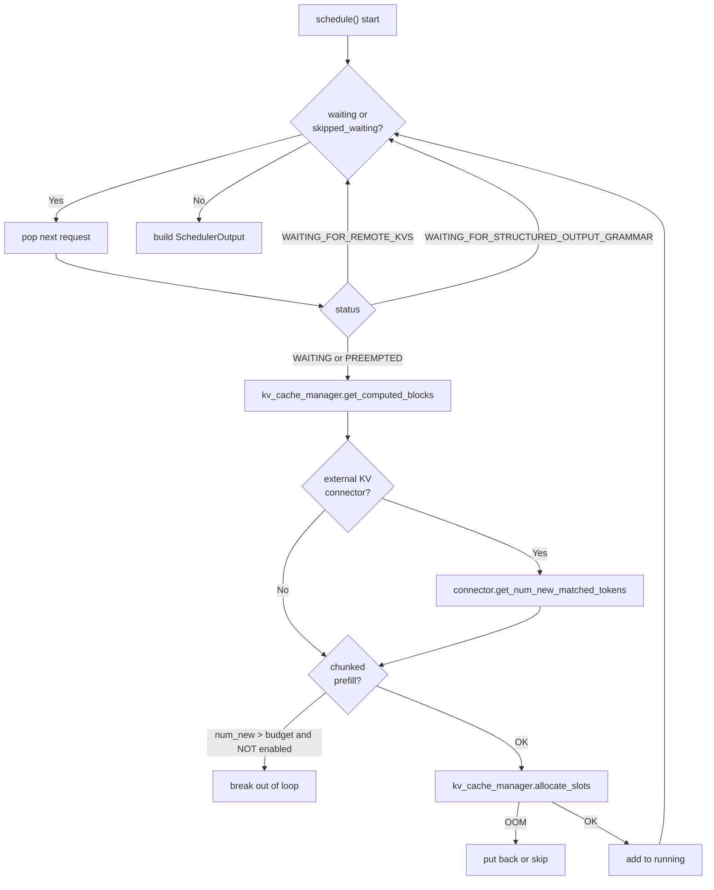
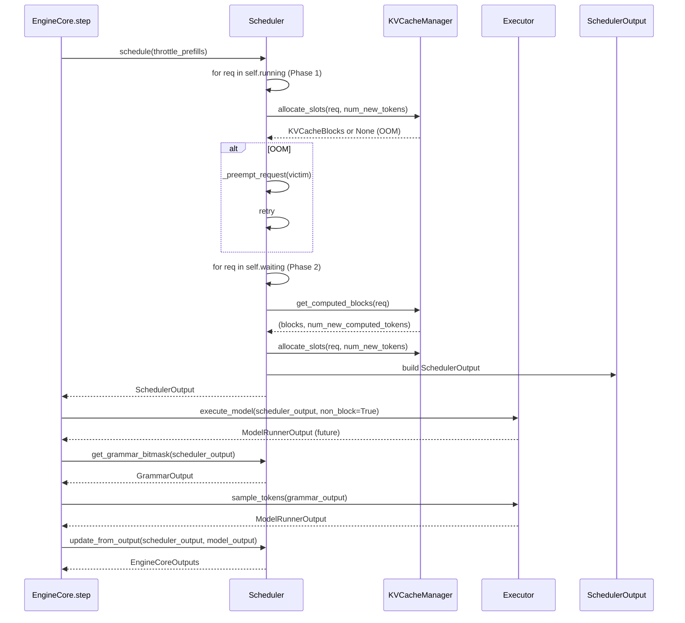

# Day 5 — Scheduling: Continuous Batching, Chunked Prefill, Prefix Caching, Preemption

**By the end of today you will understand:** how the V1 `Scheduler` decides *which requests run this step and how many tokens each gets*, how continuous batching, chunked prefill, and prefix caching interlock inside a single `schedule()` call, how preemption is triggered and reversed, and how the async scheduler variant overlaps engine steps with worker execution.

> Time budget: ~55 minutes.

Prereq: Day 1 (engine flow), Day 4 (KV cache).

## 1. What "continuous batching" is in one paragraph

Traditional batched inference sizes each batch at admission time: `N` requests go in, they run to completion, then the next `N` start. Continuous batching (a.k.a. "iteration-level scheduling") re-decides the batch every step. A short request can finish and free its KV blocks *while* longer requests keep decoding, and a new request can be admitted into the batch on the very next step. This is what the vLLM `Scheduler` does.

**The core knob is `Scheduler.schedule()`** — called once per engine step — which returns a `SchedulerOutput` describing:

- Which running requests get to run this step, and how many new tokens each of them gets.
- Which waiting requests are admitted this step (fresh or preempted).
- Per-request scheduled spec-decode drafts.
- KV-connector / EC-connector metadata.

The `token_budget` for the step is `max_num_scheduled_tokens` (= `--max-num-batched-tokens`). The scheduler subtracts from it as requests are admitted; when it hits zero (or when there are no more waiting requests), it emits the `SchedulerOutput` and returns.

## 2. `Scheduler.__init__` — the fields that matter

`vllm/v1/core/sched/scheduler.py:68`. Read `__init__` (lines 69–333) once. Highlights:

| Line | Field | What it controls |
| --- | --- | --- |
| 108 | `self.max_num_running_reqs` | Max concurrent requests (`--max-num-seqs`) |
| 109–113 | `self.max_num_scheduled_tokens` | Per-step token budget (`--max-num-batched-tokens`) |
| 114 | `self.max_model_len` | Context length cap |
| 174–184 | `self.waiting`, `self.skipped_waiting`, `self.running` | The three queues |
| 174 | `self.policy` | `SchedulingPolicy.FCFS` or `.PRIORITY` |
| 222–226 | `self.encoder_cache_manager` | Vision-encoder output cache (for VLMs) |
| 228–254 | `self.num_spec_tokens`, `self.dynamic_sd_lookup`, `self.use_eagle` | Spec-decode state |
| 259–273 | `self.kv_cache_manager = KVCacheManager(...)` | The Day-4 KV manager; `enable_caching = cache_config.enable_prefix_caching` |
| 292–296 | mamba layer flags | Force block-aligned splits for hybrid models |
| 329–333 | `self.pause_state`, `self._inflight_prefills` | Pause API + track partial prefills |

Note: `enable_chunked_prefill` is **not** a stored attribute; it's read on the fly from `self.scheduler_config.enable_chunked_prefill` at scheduling time (line 829). `long_prefill_token_threshold` is likewise read from `self.scheduler_config`.

## 3. `Scheduler.schedule()` — the main event

`vllm/v1/core/sched/scheduler.py:393`. The method is ~700 lines. The structure is two phases.

### 3a. Phase 1: running-queue advance

For each request already in `self.running`, the scheduler computes how many new tokens to append this step.

Key line — the running-request token count:

```470:486:vllm/v1/core/sched/scheduler.py
        num_new_tokens = (
            request.num_tokens_with_spec + request.num_output_placeholders
            - request.num_computed_tokens
        )
        if (0 < self.scheduler_config.long_prefill_token_threshold < num_new_tokens):
            num_new_tokens = self.scheduler_config.long_prefill_token_threshold
        num_new_tokens = min(num_new_tokens, token_budget)
        ...
        num_new_tokens = min(
            num_new_tokens,
            self.max_model_len - request.num_computed_tokens
                - num_sampled_tokens_per_step,
        )
```

Then it allocates KV blocks via `self.kv_cache_manager.allocate_slots(...)` (line 532). If the pool is out of blocks, the scheduler **preempts** a lower-priority running request (lines 542–579), calling `_preempt_request` (line 1136). The preempted request goes back to the front of `self.waiting`.

### 3b. Phase 2: waiting-queue admission

`vllm/v1/core/sched/scheduler.py:634` and onward.



### 3c. Chunked prefill decision

The critical lines (waiting phase):

```822:836:vllm/v1/core/sched/scheduler.py
        if (0 < self.scheduler_config.long_prefill_token_threshold < num_new_tokens):
            num_new_tokens = self.scheduler_config.long_prefill_token_threshold
        if (
            not self.scheduler_config.enable_chunked_prefill
            and num_new_tokens > token_budget
        ):
            break
        num_new_tokens = min(num_new_tokens, token_budget)
```

- If **chunked prefill is disabled** and the request's prompt doesn't fit in the remaining budget: `break` out of the loop. The request stays at the head of `self.waiting` and no more waiting requests are admitted this step. This preserves FCFS.
- If **chunked prefill is enabled**: clamp `num_new_tokens` to `token_budget`. The request runs a chunk this step and the rest in later steps.

After the loop, `_update_after_schedule` at `:1159` sets `request.is_prefill_chunk` (line 1176):

```1176:1184:vllm/v1/core/sched/scheduler.py
            request.is_prefill_chunk = (
                request.num_computed_tokens
                < (request.num_tokens + request.num_output_placeholders)
            )
            if request.use_structured_output and not request.is_prefill_chunk:
                scheduler_output.has_structured_output_requests = True
```

This flag matters because grammar bitmasks are only applied when *not* in a prefill chunk (a chunk that doesn't sample a token doesn't need a bitmask).

### 3d. Prefix caching hook

Right at the top of the waiting-request logic:

```719:719:vllm/v1/core/sched/scheduler.py
                computed_blocks, num_new_computed_tokens = (
                    self.kv_cache_manager.get_computed_blocks(request))
```

This calls the Day-4 API. The returned `KVCacheBlocks` bumps `num_computed_tokens` upfront (line 720) so the scheduler treats the cache hit as "already done" for that many tokens. External KV connectors (P/D or offloading) can add *further* new-matched tokens at line 731 (`connector.get_num_new_matched_tokens`).

### 3e. Preemption

`_preempt_request(request, timestamp)` at `:1136`:

1. Free blocks via `_free_request_blocks`.
2. Free encoder cache.
3. Remove from `_inflight_prefills`.
4. Set `RequestStatus.PREEMPTED`, reset `num_computed_tokens = 0`, clear spec tokens, bump `num_preemptions`.
5. `self.waiting.prepend_request(request)` — put it back at the front (in FCFS).

Call sites: (a) OOM in the running-phase allocation loop (`:571`) and (b) `reset_prefix_cache` path (`:2197`).

### 3f. Spec decode drafts

Two spec-decode touchpoints during scheduling:

- `vllm/v1/core/sched/scheduler.py:590-606` — for each running request with `request.spec_token_ids`, computes `num_scheduled_spec_tokens = min(len(spec_token_ids), num_new_tokens - 1)` and stashes into `scheduled_spec_decode_tokens[req_id]`. Also clears `request.spec_token_ids` — the next round of drafts will be populated by `update_draft_token_ids` (see Day 6).
- `vllm/v1/core/sched/scheduler.py:1081-1104` — dynamic SD table lookup: `num_spec_tokens_to_schedule = dynamic_sd_lookup[current_bs] if dynamic_sd_lookup else num_spec_tokens`.

## 4. `SchedulerOutput` — the contract to the worker

`vllm/v1/core/sched/output.py:181`. Every field:

| Field | Line | Meaning |
| --- | --- | --- |
| `scheduled_new_reqs: list[NewRequestData]` | 185 | Requests entering the running batch this step |
| `scheduled_cached_reqs: CachedRequestData` | 189 | Diffs for already-running requests (new block ids, new tokens) |
| `num_scheduled_tokens: dict[str, int]` | 193 | Per-request token count for this step |
| `total_num_scheduled_tokens: int` | 196 | Sum of the above |
| `scheduled_spec_decode_tokens: dict[str, list[int]]` | 200 | Drafts to verify per request |
| `scheduled_encoder_inputs: dict[str, list[int]]` | 205 | MM encoder inputs to run this step |
| `num_common_prefix_blocks: list[int]` | 207 | Per-group count for cascade attention |
| `finished_req_ids: set[str]` | 212 | Requests finishing this step |
| `free_encoder_mm_hashes: list[str]` | 215 | Encoder-cache entries to evict |
| `kv_connector_metadata` | 233 | KV connector control info |
| `ec_connector_metadata` | 236 | EC connector control info |

`SchedulerOutput` is deep-serializable so it can cross the process boundary from EngineCore → workers.

## 5. `update_from_output` — closing the step

`vllm/v1/core/sched/scheduler.py:1493`. Called by `EngineCore.step` after `execute_model`. For each request that ran this step:

1. Speculative-decode accounting (lines 1580–1604) — computes `num_draft_tokens`, `num_accepted`, adjusts `num_computed_tokens` / `num_output_placeholders` by `num_rejected`, records stats.
2. `_update_request_with_output(...)` at `:1878` — detects stop conditions (EOS, stop strings, length, repetition), appends tokens.
3. Frees encoder inputs when their consumer finishes (line 1608).
4. Frees the request from the KV cache when finished (line 1691) via `_free_request`.
5. Builds `EngineCoreOutput` per request and returns `dict[int, EngineCoreOutputs]` keyed by client index.

## 6. Request queues and scheduling policy

`vllm/v1/core/sched/request_queue.py`:

- `SchedulingPolicy` enum at line 13: `FCFS`, `PRIORITY`.
- `FCFSRequestQueue(deque[Request])` at line 75. `pop_request = popleft`; `prepend_request = appendleft`.
- `PriorityRequestQueue` at line 131. Heap-backed. `Request.__lt__` orders by `(priority, arrival_time)`. `prepend_request` degenerates to `add_request` (line 160) since a heap has no head.
- `create_request_queue(policy)` factory at line 201.

Preemption picks the victim differently depending on policy:

```545:548:vllm/v1/core/sched/scheduler.py
        if self.policy == SchedulingPolicy.PRIORITY:
            preempted_request = self._pick_lowest_priority_running()
        else:
            preempted_request = self.running[-1]
```

## 7. Async scheduler

`vllm/v1/core/sched/async_scheduler.py:12` — `class AsyncScheduler(Scheduler)`. Used when async scheduling is enabled (worker + engine step overlap so the CPU doesn't idle while the GPU runs).

Two overrides:

1. `_update_after_schedule` at `:19-49` — bumps `num_output_placeholders` by `num_sampled_tokens_per_step + cur_num_spec_tokens`. This means the next `schedule()` treats not-yet-sampled tokens as already reserved (they will be sampled by the next `sample_tokens` call). Seeds `spec_token_ids` with `[-1] * n` so the token-count arithmetic is right. For MRv2, sets `next_decode_eligible_step = current_step + pp_size` (one decode per request per `pp_size` steps).

2. `_update_request_with_output` at `:51-75` — when a force-preemption discards an in-flight output, decrements `num_output_placeholders`; caches blocks only up to `num_computed_tokens - num_output_placeholders` so unsampled tokens are never persisted to the prefix cache.

Doc: `docs/design/optimization_levels.md` (mentions async scheduling).

## 8. Diagram: scheduling loop



## 9. Utilities worth knowing

`vllm/v1/core/sched/utils.py`:

- `check_sequence_repetition(token_ids, params)` at `:28` — repetition-detection stop check (used by `check_stop`).
- `remove_all(lst, items_to_remove)` at `:62` — optimized list-minus-set.
- `check_stop(request, max_model_len)` at `:94` — the canonical stop check for sampling requests (EOS, stop_token_ids, length caps, repetition). Sets `request.status` to the appropriate `FINISHED_*`.

## 10. Comprehension checks

1. Why does chunked prefill improve throughput but not necessarily latency? What is the tradeoff with `--max-num-batched-tokens`?
2. Explain preemption in FCFS vs. PRIORITY policy: which running request gets evicted, and why can't we just kick it out of memory without saving state? (Trace `_preempt_request`.)
3. `Scheduler.schedule()` walks the running queue *before* the waiting queue. Why does the order matter?
4. What is the difference between `num_computed_tokens`, `num_tokens_with_spec`, and `num_output_placeholders` on a `Request`? Why do we need all three? (Read the `Request` properties starting at `vllm/v1/request.py:247`.)
5. `AsyncScheduler` seeds `spec_token_ids` with `[-1] * n` while the drafts haven't been proposed yet. What is that `-1` used for? (Hint: see `pad_spec_decode` at `scheduler.py:986`.)

## 11. Hands-on exercise

Open `vllm/v1/core/sched/scheduler.py:393` and read `schedule()` in one sitting. Do not try to memorize; focus on the shape.

Then answer:

1. If `max_num_batched_tokens = 8192` and you have three requests waiting with prompt lengths 3000 / 5000 / 200, in what order do they get scheduled if chunked prefill is **disabled**? What about **enabled**? Trace the token_budget arithmetic.
2. What happens if a running request needs one more KV block, and the pool has zero free blocks *and* zero prefix-cached blocks? Trace `allocate_slots` → OOM → `_preempt_request` → the preempted request re-appearing at the head of `self.waiting`.
3. When you set `--enable-prefix-caching` and a second identical request comes in after the first has finished, what is the block-count and token-count breakdown returned by `get_computed_blocks`? Confirm by reading `_hit_at_least_one_shorter` at `vllm/v1/core/kv_cache_manager.py:213`.

Bonus: skim `docs/design/prefix_caching.md` (short read) and cross-check the described semantics against `hash_block_tokens` at `vllm/v1/core/kv_cache_utils.py:577`.

Tomorrow (Day 6): the speculative-decoding framework — how drafts are proposed, verified, and threaded back into the scheduler.
