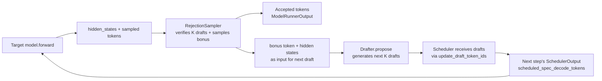
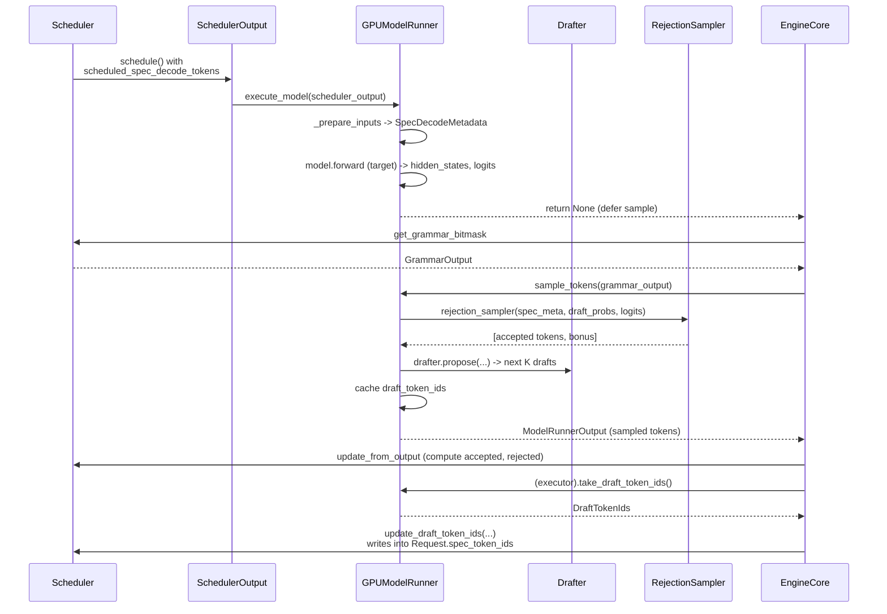

# Day 6 — Speculative Decoding: Core Framework and Control Flow

**By the end of today you will understand:** the proposer/verifier architecture in V1 vLLM, the `SpecDecodeBaseProposer` interface, how the `GPUModelRunner` creates a drafter and integrates it into `execute_model`/`sample_tokens`, how `RejectionSampler` verifies draft tokens using the `SpecDecodeMetadata` bookkeeping bundle, and how the scheduler cycles drafts through `update_draft_token_ids` and `scheduled_spec_decode_tokens`.

> Time budget: ~55 minutes.

Prereq: Day 1 (engine flow), Day 5 (scheduler).

## 1. What speculative decoding is, in one paragraph

Speculative decoding accelerates autoregressive generation by using a **cheap draft process** to *guess* the next K tokens, then having the **expensive target model** *verify* all K guesses in a single forward pass. When the target agrees with a draft, we skip a whole forward pass; when it disagrees, we resample from the target's distribution. If the draft is good enough, the batch runs through the target fewer times, and throughput improves. All correctness proofs (draft-model-based, EAGLE, MTP, Medusa, n-gram) reduce to some flavor of rejection sampling of the target distribution.

## 2. The proposer/verifier control flow



Two things you should notice:

- **Draft and verify happen on the same worker** (GPU rank), *inside* `GPUModelRunner`. The scheduler never sees a "verify" call — it just knows how many draft tokens to include per request via `scheduled_spec_decode_tokens`.
- The **drafter's output feeds the next scheduler step**, not the current one. Drafts computed at step N are verified at step N+1.

## 3. Configuration

`vllm/config/speculative.py:77` — `class SpeculativeConfig`. Selecting a method:

```61:71:vllm/config/speculative.py
SpeculativeMethod = Literal[
    "ngram", "medusa", "mlp_speculator", "draft_model", "suffix", "custom_class",
    EagleModelTypes,       # eagle, eagle3, extract_hidden_states, MTP variants, dflash
    NgramGPUTypes,         # ngram_gpu
    DSparkModelTypes,      # dspark
]
```

Method-classification helpers on `SpeculativeConfig`:

- `use_eagle()` at `:1181` — True for `("eagle", "eagle3", "mtp", "dflash", "dspark")`. This is why the same `EagleProposer` runs all five.
- `use_dflash()` at `:1187`, `use_dspark()` at `:1190`.
- `use_gemma4_mtp()` at `:1165`, `use_step3p5_mtp()` at `:1173`.
- `uses_draft_model()` at `:1196`, `uses_extract_hidden_states()` at `:1199`, `use_ngram_gpu()` at `:1202`.
- `uses_dynamic_speculative_decoding()` at `:1193`.

Notable fields:

| Field | Line | Meaning |
| --- | --- | --- |
| `num_speculative_tokens` | 83 | K, the number of drafts per step |
| `model` | 86 | Draft model HF ID / speculators checkpoint |
| `method` | 89 | The `SpeculativeMethod` literal |
| `draft_tensor_parallel_size` | 97 | Draft TP (must == target TP for `draft_model`) |
| `quantization`, `moe_backend`, `attention_backend` | 105, 109, 114 | Draft-side overrides |
| `disable_padded_drafter_batch` | 131 | CPU vs GPU path for building drafter inputs |
| `use_heterogeneous_vocab` | 142 | TLI vocab mapping between draft and target |
| `parallel_drafting` | 157 | Enables PARD / DFlash's parallel drafter |
| `rejection_sample_method` | 208 | `"standard"` (Leviathan), `"synthetic"`, or `"block"` |
| `synthetic_acceptance_rates` | 216 | Curve for synthetic verification |
| `draft_sample_method` | 275 | `"greedy"` or `"probabilistic"` |
| `num_speculative_tokens_per_batch_size` | 170 | Dynamic SD schedule |

## 4. Where the drafter is created

`vllm/v1/worker/gpu_model_runner.py:564`. Only the last PP rank creates a drafter:

```564:571:vllm/v1/worker/gpu_model_runner.py
        if self.speculative_config and get_pp_group().is_last_rank:
            self.drafter: (NgramProposer | NgramProposerGPU | SuffixDecodingProposer
                | EagleProposer | DFlashProposer | DraftModelProposer
                | MedusaProposer | ExtractHiddenStatesProposer | Gemma4Proposer
                | Step3p5MTPProposer)
            ...
```

Dispatch by method (see full block at lines 564–639):

| Condition | Drafter |
| --- | --- |
| `method == "custom_class"` | `create_custom_proposer(...)` |
| `method == "ngram"` | `NgramProposer` |
| `uses_draft_model()` | `DraftModelProposer` |
| `use_ngram_gpu()` | `NgramProposerGPU` |
| `use_gemma4_mtp()` | `Gemma4Proposer` |
| `use_step3p5_mtp()` | `Step3p5MTPProposer` |
| `use_dflash()` | `DFlashProposer` (with `use_aux_hidden_state_outputs = True`) |
| `method == "suffix"` | `SuffixDecodingProposer` |
| `use_eagle()` (eagle/eagle3/mtp/dflash/dspark) | `EagleProposer` |
| `method == "medusa"` | `MedusaProposer` |
| `method == "extract_hidden_states"` | `ExtractHiddenStatesProposer` (with `use_aux_hidden_state_outputs = True`) |

And unconditionally after the dispatch:

```638:639:vllm/v1/worker/gpu_model_runner.py
        self.rejection_sampler = RejectionSampler(
            self.sampler, self.speculative_config, self.device)
```

## 5. `SpecDecodeBaseProposer` — the interface

`vllm/v1/spec_decode/llm_base_proposer.py:67`. It is not a formal ABC; the interface is a Python duck-typed contract shared with the non-base-class proposers (`NgramProposer`, `MedusaProposer`, `SuffixDecodingProposer`, etc.). The methods a proposer may implement:

| Method | Where called | Purpose |
| --- | --- | --- |
| `propose(...)` | `gpu_model_runner.py:4886-5133` | Return draft tokens for this step. Signatures differ per proposer. |
| `load_model(target_model)` | `gpu_model_runner.py:5185` | Build the draft `nn.Module`, share `embed`/`lm_head` with target if applicable. |
| `dummy_run(num_tokens, ...)` | Dummy-run / cudagraph capture path | Warm up + profile. |
| `initialize_cudagraph_keys(mode)` | `_check_and_update_cudagraph_mode` | Wire up dispatcher keys after `adjust_cudagraph_sizes_for_spec_decode`. |
| `initialize_attn_backend(kv_cache_config, ...)` | KV-cache init path | Build `AttentionGroup`s for drafter layers. |
| `prepare_next_token_ids_padded(...)` | `gpu_model_runner.py:5040` (GPU path, default) | Build next-token ids + valid counts via Triton kernel. |
| `prepare_next_token_ids_cpu(...)` | `gpu_model_runner.py:5024` | CPU path when `disable_padded_drafter_batch=True`. |
| `prepare_inputs_padded(...)` / `prepare_inputs(...)` | `gpu_model_runner.py:5077-5096` | Rewrite `CommonAttentionMetadata` for rejected tokens. |
| `set_eplb_state(state)` | Runner init | For MoE drafters. |
| `take_last_draft_probs()` | `gpu_model_runner.py:5134` | Return cached draft probs for "standard" + "probabilistic" rejection. |

`SpecDecodeBaseProposer` also owns the K-step drafting loop itself (`propose`, `set_inputs_first_pass`, `build_model_inputs_first_pass`, `build_per_group_and_layer_attn_metadata`, `_greedy_sample`, `_sample_draft_tokens`, `_sample_from_logits`, `_maybe_share_embeddings`, `_maybe_share_lm_head`). Subclasses override strategic hooks (see Day 7).

## 6. Where drafts get proposed inside `sample_tokens`

`vllm/v1/worker/gpu_model_runner.py:4491` — the `propose_draft_token_ids` closure inside `sample_tokens` dispatches to `self.propose_draft_token_ids(...)` at `:4863`:

```4881:4919:vllm/v1/worker/gpu_model_runner.py
        if spec_config.method == "ngram":
            ...
        elif spec_config.method == "custom_class":
            ...
        elif spec_config.use_ngram_gpu():
            ...
        elif spec_config.method == "suffix":
            ...
        elif spec_config.method == "medusa":
            ...
        elif spec_config.uses_extract_hidden_states():
            ...
        elif (spec_config.use_eagle() or spec_config.use_dflash()
              or spec_config.uses_draft_model()):
            draft_token_ids = self.drafter.propose(
                num_speculative_tokens=num_spec_tokens_to_schedule,
                target_token_ids=..., target_positions=...,
                target_hidden_states=...,
                next_token_ids=next_token_ids,
                token_indices_to_sample=...,
                sampling_metadata=...,
                common_attn_metadata=...,
                mm_embed_inputs=...,
                num_rejected_tokens_gpu=...,
                slot_mappings=slot_mappings,
            )
```

Two timing modes:

- **Before bookkeeping** (`use_gpu_toks = True` at line 4519): EAGLE / draft-model / n-gram-GPU / extract-hidden-states. Runs directly off the GPU-side sampled tokens for lowest latency.
- **After bookkeeping** (`propose_drafts_after_bookkeeping = True` at line 4601): ngram (CPU), custom_class, suffix, medusa. Runs off CPU-side `valid_sampled_token_ids`.

If `_input_fits_in_drafter` returns False (line 4511), the runner zeroes out draft tokens and skips drafting for that step.

## 7. `SpecDecodeMetadata` — the verification bundle

`vllm/v1/spec_decode/metadata.py:9`:

```9:27:vllm/v1/spec_decode/metadata.py
@dataclass
class SpecDecodeMetadata:
    draft_token_ids: torch.Tensor          # [num_tokens]
    num_draft_tokens: list[int]            # [batch_size]
    cu_num_draft_tokens: torch.Tensor      # [batch_size]
    cu_num_sampled_tokens: torch.Tensor    # [batch_size]
    target_logits_indices: torch.Tensor    # [num_tokens]
    bonus_logits_indices: torch.Tensor     # [batch_size]
    logits_indices: torch.Tensor           # [num_tokens + batch_size]
```

Field meanings (worked example at `gpu_model_runner.py:2775-2848`, `_calc_spec_decode_metadata`):

- `draft_token_ids` — flat list of the drafts to verify this step (produced at the previous step).
- `num_draft_tokens` / `cu_num_draft_tokens` — per-request K and its cumsum.
- `cu_num_sampled_tokens` — cumsum of `num_draft_tokens + 1` (the +1 is the *bonus* token always sampled at the end).
- `target_logits_indices` — flat indices into the target's logits tensor for the K draft positions.
- `bonus_logits_indices` — one row per request: the "post-last-draft" position where we always sample.
- `logits_indices` — union of the above (used both for input assembly and by the rejection sampler).

## 8. Verification: `RejectionSampler`

`vllm/v1/sample/rejection_sampler.py:37` — `class RejectionSampler(nn.Module)`. Docstring cites Leviathan et al., arXiv 2211.17192.

`__init__` (line 60) plugs in the base `Sampler`, supports `spec_config.rejection_sample_method == "synthetic"` (pre-computes `synthetic_conditional_rates`).

`forward(spec_decode_metadata, draft_probs, logits, sampling_metadata)` at `:88`:

1. Sample the bonus token per request from `logits[bonus_logits_indices]` using the ordinary `Sampler` (line 130).
2. Slice draft-position logits with `logits[target_logits_indices]`, cast to fp32, apply logits processors + constraints (lines 148–167).
3. Call `rejection_sample(...)` at line 169 (Triton kernel at line 394 in the same file). Output: `[batch_size, max_spec_len + 1]` where rejected positions are `PLACEHOLDER_TOKEN_ID = -1`.

`parse_output` (static method at `:249`) filters out placeholders and returns the per-request `list[list[int]]` of accepted tokens.

## 9. `GPUModelRunner._sample` — dispatch

`vllm/v1/worker/gpu_model_runner.py:3573`:

```3573:3602:vllm/v1/worker/gpu_model_runner.py
    def _sample(self, logits, spec_decode_metadata):
        sampling_metadata = self.input_batch.sampling_metadata
        self.input_batch.update_async_output_token_ids()
        if spec_decode_metadata is None:
            return self.sampler(logits=logits, sampling_metadata=sampling_metadata)
        ...
        draft_probs = self._get_spec_decode_draft_probs(spec_decode_metadata)
        sampler_output = self.rejection_sampler(
            spec_decode_metadata, draft_probs, logits, sampling_metadata)
        return sampler_output
```

`SpecDecodeMetadata` is built in `_calc_spec_decode_metadata` (line 2775), which is invoked from `_prepare_inputs` (line 2208) whenever `use_spec_decode = len(scheduler_output.scheduled_spec_decode_tokens) > 0` (line 2178).

## 10. Drafts flowing back to the scheduler

Three moving parts:

1. **Runner side**: `GPUModelRunner.take_draft_token_ids()` at `:4742` returns a `DraftTokenIds` (defined in `vllm/v1/outputs.py:311`).

2. **Worker / executor plumbing**:
   - `Worker.take_draft_token_ids()` at `vllm/v1/worker/gpu_worker.py:1045`.
   - `Executor.take_draft_token_ids()` at `vllm/v1/executor/abstract.py:252`.
   - `UniProcExecutor.take_draft_token_ids()` at `uniproc_executor.py:133`.
   - `MultiprocExecutor.take_draft_token_ids()` at `multiproc_executor.py:334`.

3. **Engine core**: drains after the step at `vllm/v1/engine/core.py:514-517`:

```514:517:vllm/v1/engine/core.py
        if self.check_for_draft_tokens and not self.async_scheduling and model_executed:
            draft_token_ids = self.model_executor.take_draft_token_ids()
            if draft_token_ids is not None:
                self.scheduler.update_draft_token_ids(draft_token_ids)
```

The scheduler side:

- `Scheduler.update_draft_token_ids(draft_token_ids)` at `vllm/v1/core/sched/scheduler.py:1929` — copies fresh drafts into each `Request.spec_token_ids` (skipping finished / prefill-chunk requests; validates via grammar).
- `Scheduler.update_draft_token_ids_in_output(...)` at `:1951` — writes drafts *into an already-emitted SchedulerOutput* for deferred grammar validation in the async pipeline.

Then, on the **next** `schedule()`, lines 590–606 pack `request.spec_token_ids` into `scheduled_spec_decode_tokens` on the new `SchedulerOutput`.

## 11. Interaction with other features

### Structured output

`Scheduler.get_grammar_bitmask(scheduler_output)` at `vllm/v1/core/sched/scheduler.py:1469` accepts `scheduled_spec_decode_tokens` and:

- Serial path (line 263 of `structured_output/__init__.py`, `_fill_bitmasks`) — for each request, advances the grammar FSM through each spec token, filling per-position bitmasks, then rolls back after the step. Rejected drafts get rolled back too.

The bitmask is applied *before* rejection sampling in `_sample` (via `apply_grammar_bitmask` at `structured_output/utils.py:85`, invoked at `gpu_model_runner.py:4462`).

### Async scheduling

`AsyncScheduler._update_after_schedule` (Day 5, lines 19-49) seeds `spec_token_ids` with `[-1] * n` so `pad_spec_decode = True` can insert padding drafts and keep cudagraph shapes uniform. See `scheduler.py:986`.

### Dynamic SD

`vllm/v1/spec_decode/dynamic/utils.py`:

- `validate_and_normalize_dynamic_sd_schedule(...)` at `:7` — parses `[(bs_start, bs_end, K), ...]`.
- `build_dynamic_sd_schedule_lookup(...)` at `:77` — expands to a dense array so the scheduler picks K as `dense[current_bs]` in O(1).

The scheduler reads it at line 1084. Documented limitation (`docs/features/speculative_decoding/dynamic_speculative_decoding.md`): only tested with EAGLE / EAGLE-3, MRv1 only, forces piecewise CUDA graph.

## 12. Diagram: end-to-end per-step control flow



## 13. Comprehension checks

1. Why is the drafter only created on the last PP rank? What would happen if you created one on every rank?
2. Explain the difference between `use_gpu_toks = True` and `propose_drafts_after_bookkeeping = True` paths in `sample_tokens`. Which methods use which?
3. `SpecDecodeMetadata` has both `logits_indices` (union) and `target_logits_indices` + `bonus_logits_indices` (separated). Why keep all three?
4. In `RejectionSampler.forward`, what happens for a request that draft-proposed the same token that the target sampled? What if they disagreed on the first draft position? (Read the docstring at line 38.)
5. Why does `AsyncScheduler` add `-1` sentinel drafts before the drafter has run? What does the runner do with them?

## 14. Hands-on exercise

Open three files:

- `vllm/v1/spec_decode/metadata.py` (short — 30 lines).
- `vllm/v1/worker/gpu_model_runner.py:2775` (`_calc_spec_decode_metadata`, the "worked example" of what each field means).
- `vllm/v1/sample/rejection_sampler.py:88` (`RejectionSampler.forward`).

Then trace a step where a single request has `K=3` drafts:

1. What is `target_logits_indices` vs. `bonus_logits_indices`?
2. Which four logits rows get consumed for this request? Which is the bonus?
3. If `RejectionSampler` accepts the first two drafts but rejects the third, how many tokens get appended to the request's output this step? What happens to the fourth position?

Verify by finding where `num_rejected` is subtracted from `num_computed_tokens` in `Scheduler.update_from_output` at `scheduler.py:1577-1604`.

Bonus: read `docs/features/speculative_decoding/README.md` for the qualitative selection guide.

Tomorrow (Day 7): each speculative method in detail — n-gram, suffix, draft-model, EAGLE, Medusa, MTP, DFlash — and how they differ.
