# Day 7 — Speculative Decoding Methods Compared

**By the end of today you will understand:** each speculative decoding method vLLM supports (n-gram, suffix, draft-model, EAGLE, EAGLE-3, Medusa, MTP variants, DFlash, dynamic SD, extract-hidden-states), what code implements each one, and — importantly — the distinctions between EAGLE and MTP, and between EAGLE and Medusa.

> Time budget: ~60 minutes.

Prereq: Day 6 (spec-decode framework).

## 1. Method taxonomy

Two axes classify every method:

- **Where do drafts come from?** From the request's own history (n-gram, suffix), from a separate small LLM (draft-model, MLP-speculator), from a single-layer head on the target's hidden states (EAGLE), from parallel prediction heads (Medusa), or from extra layers baked into the target checkpoint (MTP).
- **How is the draft loop structured?** Autoregressive K-step (draft-model, EAGLE, MTP) or single-pass parallel (Medusa, DFlash).

| Method | Draft source | Loop | Config `method` |
| --- | --- | --- | --- |
| n-gram | Prompt lookup (CPU) | Single scan | `"ngram"` |
| n-gram GPU | Prompt lookup (GPU) | Single scan | `"ngram_gpu"` |
| suffix | Adaptive trie (Arctic Inference) | Single query | `"suffix"` |
| draft-model | Separate LLM | K-step autoregressive | `"draft_model"` |
| MLP-speculator | Multi-head MLP | Parallel per step | `"mlp_speculator"` |
| EAGLE | 1-layer head over target hidden states | K-step autoregressive | `"eagle"` |
| EAGLE-3 | 1-layer head + aux hidden states | K-step autoregressive | `"eagle3"` |
| Medusa | K parallel heads | Single pass | `"medusa"` |
| MTP | Target-baked extra layers | K-step autoregressive | `"mtp"` |
| DFlash | Parallel cross-attention drafter | Single pass | `"dflash"` |
| DSpark | Parallel-drafter variant | Single pass | `"dspark"` |
| Gemma 4 MTP | Gemma 4 assistant checkpoint | K-step autoregressive | `"mtp"` (auto-remapped) |
| Step3.5 MTP | With per-KV-group slots | K-step autoregressive | `"mtp"` (auto-remapped) |
| Dynamic SD | Wraps any of the above | Adaptive K | `num_speculative_tokens_per_batch_size` |
| extract-hidden-states | Not really speculative | K=1 pseudo-draft | `"extract_hidden_states"` |

## 2. Method-by-method summary

Each entry below has: **config**, **proposer class + line**, **model file(s)** (if any), and **the key idea**.

### 2a. n-gram — `method="ngram"`

- **Config**: `method: "ngram"`, `prompt_lookup_min`, `prompt_lookup_max`, `num_speculative_tokens`. Docs: `docs/features/speculative_decoding/n_gram.md`.
- **Proposer**: `NgramProposer` at `vllm/v1/spec_decode/ngram_proposer.py:12`. Instantiated at `gpu_model_runner.py:584`.
- **Model**: none.
- **How it works**: for each request, scan the request's own `token_ids_cpu` for the longest suffix n-gram (length in `[min_n, max_n]`) that already occurred earlier. The next K tokens after that earliest occurrence become the draft. Uses a KMP-LPS-style scan (`_find_longest_matched_ngram_and_propose_tokens` at line 207). Multi-request batching is JIT-parallelised with numba (`batch_propose_numba` at line 178 with `@njit(parallel=True)`).

### 2b. n-gram GPU — `method="ngram_gpu"`

- **Config**: same as n-gram.
- **Proposer**: `NgramProposerGPU` at `vllm/v1/spec_decode/ngram_proposer_gpu.py:216`, with vectorised `NgramGPUKernel` at line 28. `@support_torch_compile()`.
- **How it works**: same idea as ngram but uses `torch.unfold` + `argmax` to find the earliest match across the batch in parallel (`_find_first_and_extract_all_n_parallel` at line 47).

### 2c. Suffix decoding — `method="suffix"`

- **Config**: `method: "suffix"`, plus `suffix_decoding_{max_tree_depth, max_cached_requests, max_spec_factor, min_token_prob}` on `SpeculativeConfig` (`config/speculative.py:183-202`).
- **Proposer**: `SuffixDecodingProposer` at `vllm/v1/spec_decode/suffix_decoding.py:9`. Instantiated at `gpu_model_runner.py:616`.
- **Dependency**: `pip install arctic-inference` (Snowflake). See `docs/features/speculative_decoding/suffix.md`.
- **How it works**: not simple n-gram. Uses a proper trie via `arctic_inference.suffix_decoding.SuffixDecodingCache`. Unlike ngram: (1) pattern-matches against both the prompt *and* previous generations, (2) uses frequency counts to rank likely continuations, (3) speculates an **adaptive** K per request per step (`max_spec_factor * prefix_match_length`, capped by `num_speculative_tokens`). Each `propose` call updates the per-request cache with new sampled ids (`add_active_response` at line 75), extracts a length-`max_tree_depth` pattern from the tail, and asks the cache to `speculate` (line 81).

### 2d. Draft model — `method="draft_model"`

- **Config**: `method: "draft_model"`, `model: <hf-id>`, `num_speculative_tokens`, `draft_tensor_parallel_size`, optional `use_heterogeneous_vocab`, `quantization`, `moe_backend`, `parallel_drafting`. Docs: `docs/features/speculative_decoding/draft_model.md` and `parallel_draft_model.md`.
- **Proposer**: `DraftModelProposer(SpecDecodeBaseProposer)` at `vllm/v1/spec_decode/draft_model.py:19`. Instantiated at `gpu_model_runner.py:586`.
- **How it works**: loads a *separate* small LLM (via `get_model(...)` with `prefix="draft_model"` at `draft_model.py:96`). Enforces `draft_tp == target_tp` (`_raise_if_draft_tp_mismatch` at line 63). Explicitly disables embed / lm_head sharing (draft model is fully independent, lines 108/113). The K-step autoregressive loop lives entirely in `SpecDecodeBaseProposer.propose` (`llm_base_proposer.py:501`).
- **Heterogeneous vocab (TLI)**: when `use_heterogeneous_vocab=True`, a `VocabMapping` (`vllm/v1/spec_decode/vocab_mapping.py`) translates between draft and target token IDs and constrains draft logits to the shared vocabulary — the TLI (Token-Level Intersection) algorithm.
- **PARD (Parallel Draft Model)**: not its own file — enabled via `speculative_config.parallel_drafting=True` with `method="draft_model"` (or `dflash`/`dspark`). Picks up its mask token from the draft config's `pard_token`/`ptd_token_id`. See `llm_base_proposer.py:346-365`.

### 2e. MLP-speculator — `method="mlp_speculator"`

- **Config**: `method: "mlp_speculator"`, IBM pre-trained checkpoint via `model`. Docs: `docs/features/speculative_decoding/mlp.md`.
- **Model**: `vllm/model_executor/models/mlp_speculator.py:63-68` (paper 2404.19124).
- **Checkpoints**: pre-trained by IBM on HF hub: `ibm-ai-platform/{llama-13b,llama3-8b,codellama-34b,llama2-70b,llama3-70b}-accelerator`; `ibm-granite/granite-{3b-code-instruct,8b-code-instruct,7b-instruct,20b-code-instruct}-accelerator`.

### 2f. EAGLE — `method="eagle"` and `method="eagle3"`

- **Config**: `method: "eagle"` or `"eagle3"`, `model: <eagle-head-hf-id>`, `num_speculative_tokens`, `draft_tensor_parallel_size`. Docs: `docs/features/speculative_decoding/eagle.md`.
- **Proposer**: `EagleProposer(SpecDecodeBaseProposer)` at `vllm/v1/spec_decode/eagle.py:10`. A trivial shim that hardcodes `pass_hidden_states_to_model=True`. All real work is in `SpecDecodeBaseProposer`.
- **Model files (the draft head, one decoder layer + LM head)**:
  - LLaMA: `vllm/model_executor/models/llama_eagle.py` (`EagleLlamaForCausalLM` at line 131) and `llama_eagle3.py` (`Eagle3LlamaForCausalLM` at line 269).
  - DeepSeek: `deepseek_eagle.py:192` (`EagleDeepseekV3ForCausalLM`), `deepseek_eagle3.py:286` (`Eagle3DeepseekV2ForCausalLM`).
  - Cohere / LLaMA 4 / Mistral / MiniCPM / Qwen3 / Eagle2.5-VL variants also exist under `models/*_eagle*.py`.
- **How it works**:
  - The target model records "aux hidden states" when `self.use_aux_hidden_state_outputs=True`. For EAGLE-3, `set_aux_hidden_state_layers(layers)` (via `SupportsEagle3` at `interfaces.py:1387`) tells the target which layers to snapshot; default is `(2, num//2, num-3)` (line 1408). For EAGLE-1 the drafter uses only the target's final `hidden_states`.
  - The EAGLE draft head is one decoder layer with `fc = ReplicatedLinear(hidden_size * 2 → hidden_size)` that concatenates `input_embeds + target hidden_states`.
  - `SpecDecodeBaseProposer.propose` at `llm_base_proposer.py:501` runs K forward passes; each iteration feeds `input_ids = draft_token_ids_list[-1]` plus previous `hidden_states` back into the drafter.
  - EAGLE-3 additionally has a `combine_hidden_states` step (`llm_base_proposer.py:525-541`) that reduces a stack of aux hidden states to `hidden_size` before drafting.
  - `set_inputs_first_pass` at line 819 shifts input ids by one and slots the sampled next token into the last position (the classic EAGLE input-shift trick).
- **Mixins used** (`vllm/model_executor/models/interfaces.py`): `SupportsEagleBase` (line 1259, exposes `has_own_lm_head` / `has_own_embed_tokens` for weight sharing), `SupportsEagle` (line 1343), `SupportsEagle3` (line 1373), `EagleModelMixin` (line 1323, target-side hidden-state capture), `LocalArgmaxMixin` (line 1288, vocab-parallel argmax with optional D2T remap).

### 2g. Medusa — `method="medusa"`

- **Config**: `method: "medusa"`, `model: <medusa-head-hf-id>`, `num_speculative_tokens` (which is the number of Medusa heads).
- **Proposer**: `MedusaProposer` at `vllm/v1/spec_decode/medusa.py:18`. Does **not** inherit `SpecDecodeBaseProposer` — no autoregressive loop.
- **Model**: `vllm/model_executor/models/medusa.py:41` — `class Medusa(nn.Module)` (paper 2401.10774). K `ResidualBlock`s (each = num_hidden_layers stacked `Linear + SiLU` residuals) feed K `ParallelLMHead` heads.
- **How it works** (`MedusaProposer.propose` at line 40):

```python
        blocks = self.model(target_hidden_states)
        logits = self.model.compute_logits(blocks)
        draft_tokens = torch.stack([logit.argmax(dim=-1) for logit in logits], dim=1)
```

Each head predicts the next-`i`-token for `i ∈ [1..K]` from the same target hidden state. Faster per step than EAGLE (only one forward pass) but the heads are conditionally independent, so acceptance rate is typically lower.

### 2h. MTP — `method="mtp"`

- **Config**: `method: "mtp"`, `model: <mtp-checkpoint>`, `num_speculative_tokens`. Docs: `docs/features/speculative_decoding/mtp.md`.
- **Supported model types** (`SpeculativeConfig.MTPModelTypes` at `config/speculative.py:34-54`): `deepseek_mtp, mimo_mtp, mimo_v2_mtp, glm4_moe_mtp, glm4_moe_lite_mtp, glm_ocr_mtp, ernie_mtp, nemotron_h_mtp, exaone_moe_mtp, exaone4_5_mtp, qwen3_next_mtp, qwen3_5_mtp, longcat_flash_mtp, minimax_m3_mtp, mtp, pangu_ultra_moe_mtp, step3p5_mtp, hy_v3_mtp, gemma4_mtp`.
- **Method routing**: `use_eagle()` returns True for `method in ("eagle","eagle3","mtp","dflash","dspark")`, so MTP shares the `EagleProposer`. Gemma4 and Step3.5 have their own subclasses (`Gemma4Proposer`, `Step3p5MTPProposer`).
- **Model files** (per family): `deepseek_mtp.py`, `ernie_mtp.py`, `exaone4_5_mtp.py`, `exaone_moe_mtp.py`, `glm_ocr_mtp.py`, `glm4_moe_mtp.py`, `glm4_moe_lite_mtp.py`, `hy_v3_mtp.py`, `mimo_mtp.py`, `mimo_v2_mtp.py`, `nemotron_h_mtp.py`, `longcat_flash_mtp.py`, `openpangu_mtp.py`, `qwen3_5_mtp.py`, `qwen3_next_mtp.py`, `step3p5_mtp.py`, `gemma4_mtp.py`.
- **Example anatomy** (`vllm/model_executor/models/deepseek_mtp.py`):
  - `DeepSeekMultiTokenPredictorLayer` at line 63: `enorm(inputs_embeds) + hnorm(previous_hidden_states) → eh_proj → mtp_block → shared_head`.
  - `SharedHead` at line 43: `RMSNorm(config.hidden_size) + ParallelLMHead(vocab_size, hidden_size)`.

### 2i. **EAGLE vs. MTP** — the important distinction

They **look structurally identical**: both are an `enorm/hnorm/eh_proj` combiner of `inputs_embeds + previous_hidden_states`, one decoder block, and a shared head. The difference is packaging and training:

| | EAGLE | MTP |
| --- | --- | --- |
| **Where is the head?** | Separate `Eagle*ForCausalLM` checkpoint (`spec_config.model`) | Baked into the target checkpoint at indices `[num_hidden_layers, num_hidden_layers + num_nextn_predict_layers)` |
| **Embedding + LM head** | Its own by default (unless `SupportsEagleBase.has_own_embed_tokens=False`) | Shared with the target (see `_maybe_share_embeddings` at `llm_base_proposer.py:1462`) |
| **Training** | Trained separately (e.g. `vllm-project/speculators`, `SafeAILab/EAGLE`) | Trained jointly with the base model (e.g. DeepSeek V3/V4 ships MTP layers pre-trained) |
| **Config detection** | User specifies `method: "eagle"`/`"eagle3"` | `SpeculativeConfig.hf_config_override` at `config/speculative.py:321` auto-rewrites `deepseek_v3/deepseek_v32/glm_moe_dsa → deepseek_mtp` etc. |

At **runtime**, `use_eagle()` returns True for both, and both use the same `EagleProposer` code path. There is no runtime distinction.

### 2j. **EAGLE vs. Medusa**

| | EAGLE | Medusa |
| --- | --- | --- |
| Draft loop | K sequential forward passes | Single forward pass over K parallel heads |
| Per-step cost (draft) | K × (1-layer + LM head) | 1 × (K × (residual blocks + LM head)) |
| Conditional dependence | Draft `i` sees draft `i-1` | All drafts independent |
| Typical acceptance rate | Higher (each draft conditioned) | Lower |
| Best when | Latency budget allows sequential drafts | You want maximum decode step batchability |

### 2k. DFlash — `method="dflash"`

- **Config**: `method: "dflash"`, `model: <dflash-checkpoint>`. Forces `parallel_drafting=True` (`config/speculative.py:853`). Requires an attention backend that supports non-causal attention.
- **Proposer**: `DFlashProposer(SpecDecodeBaseProposer)` at `vllm/v1/spec_decode/dflash.py:23`. Instantiated at `gpu_model_runner.py:613`.
- **Model**: `vllm/model_executor/models/qwen3_dflash.py` (`DFlashQwen3ForCausalLM`).
- **How it works**: a **parallel drafter** that runs a single forward pass to produce all K draft tokens at once, using cross-attention where K/V come from the target model's cached hidden states and Q comes from `[bonus_token] + [mask_token] * (K-1)` query slots per request. Overrides:
  - `_create_draft_vllm_config` at `dflash.py:75` — forces `use_non_causal=True` on the attention backend when `dflash_causal=False`.
  - `set_inputs_first_pass` at `:96` — launches Triton kernel `copy_and_expand_dflash_inputs_kernel` (in `utils.py`) that writes `input_ids/positions/slot_mapping/token_indices` for context and query separately.
  - `build_model_inputs_first_pass` at `:261` — calls `self.model.precompute_and_store_context_kv(...)` (a bespoke DFlash primitive that projects target hidden states into K/V and stores them into the KV cache before the drafter's forward pass).

### 2l. Extract-hidden-states — `method="extract_hidden_states"`

- **Config**: `method: "extract_hidden_states"`. `num_speculative_tokens` must be 1. Requires `eagle_aux_hidden_state_layer_ids`. Docs: `docs/features/speculative_decoding/extract_hidden_states.md`.
- **Proposer**: `ExtractHiddenStatesProposer` at `vllm/v1/spec_decode/extract_hidden_states.py:29`.
- **How it works**: not really speculative. Sets `use_aux_hidden_state_outputs = True` on the runner so the target model captures aux hidden states from configured layer indices, then streams them out via a KV-transfer connector. Purpose: **collecting training data for a future EAGLE head**. Chunked prefill must be disabled.

### 2m. Special-purpose proposers

- **`Step3p5MTPProposer(EagleProposer)`** at `vllm/v1/spec_decode/step3p5.py:24` — adds per-KV-cache-group block tables and slot-mapping buffers so an MTP drafter can run across models that split their KV cache into multiple groups.
- **`Gemma4Proposer(SpecDecodeBaseProposer)`** at `vllm/v1/spec_decode/gemma4.py:31` — sets `constant_draft_positions=True` (all K draft steps read from the same target position), supports multiple KV cache groups (sliding + full attention), has a centroids-cudagraph fast path for the argmax head.
- **`create_custom_proposer(vllm_config)`** at `vllm/v1/spec_decode/custom_class_proposer.py:12` — imports the class named by `speculative_config.model` (e.g. `"my_module.MyProposer"`) and returns any object with a callable `propose`. Escape hatch for third-party proposers.

### 2n. Dynamic SD

- **Config**: `num_speculative_tokens_per_batch_size = [(bs_start, bs_end, K), ...]` on `SpeculativeConfig`.
- **Dispatch**: `vllm/v1/spec_decode/dynamic/utils.py`:
  - `validate_and_normalize_dynamic_sd_schedule(...)` at `:7` — validates entries (non-overlapping, sorted, covering batch size 1).
  - `build_dynamic_sd_schedule_lookup(...)` at `:77` — expands to a dense `max_num_seqs+1` array so the scheduler picks K as `dense[bs]` in O(1).
- **Scheduler use**: `scheduler.py:1082-1104` picks `num_spec_tokens_to_schedule = self.dynamic_sd_lookup[current_bs]` per step and stamps it into `SchedulerOutput`.

## 3. Diagram: draft-head anatomy compared

```mermaid
flowchart TB
    subgraph EAGLE
        E_IN[input tokens] --> E_EMB[embed]
        E_TH[target hidden_states] --> E_FC[fc: 2H -> H]
        E_EMB --> E_FC
        E_FC --> E_LYR[1 decoder layer]
        E_LYR --> E_HEAD[ParallelLMHead<br/>draft_vocab_size for E3]
        E_HEAD --> E_OUT[draft token 1]
        E_OUT --> E_IN2[reused as input<br/>for iteration 2]
    end
    subgraph Medusa
        M_TH[target hidden_states] --> M_H1[Head 1]
        M_TH --> M_H2[Head 2]
        M_TH --> M_HK[Head K]
        M_H1 --> M_OUT1[draft token 1]
        M_H2 --> M_OUT2[draft token 2]
        M_HK --> M_OUTK[draft token K]
    end
    subgraph MTP
        MT_IN[shifted input tokens] --> MT_EMB[embed shared with target]
        MT_TH[target hidden_states] --> MT_ENORM[hnorm]
        MT_EMB --> MT_HNORM[enorm]
        MT_ENORM --> MT_EH[eh_proj]
        MT_HNORM --> MT_EH
        MT_EH --> MT_BLK[MTP transformer block]
        MT_BLK --> MT_SH[SharedHead RMSNorm + ParallelLMHead]
        MT_SH --> MT_OUT[draft token 1..K]
    end
```



## 4. Docs quick reference

`docs/features/speculative_decoding/`:

| File | Content |
| --- | --- |
| `README.md` | Overview + method-selection table. Points to `vllm-project/speculators` for training. |
| `eagle.md` | Config examples for EAGLE / EAGLE-3 with pre-trained checkpoints. |
| `mtp.md` | Using models with native MTP (MiMo, DeepSeek, Gemma 4). |
| `draft_model.md` | Classic draft-model examples + heterogeneous-vocab (TLI) example. |
| `parallel_draft_model.md` | PARD with `parallel_drafting=True`. |
| `mlp.md` | MLP-speculator with IBM pre-trained heads. |
| `n_gram.md` | ngram config example. |
| `suffix.md` | Suffix decoding with `arctic-inference`. |
| `dynamic_speculative_decoding.md` | `num_speculative_tokens_per_batch_size` schedule syntax. |
| `extract_hidden_states.md` | Hidden-state extraction for offline EAGLE training. |
| `speculators.md` | Landing page for `vllm-project/speculators` (external training library). |

## 5. Comprehension checks

1. Why can EAGLE and MTP share the exact same runtime code path (`EagleProposer`) even though they're conceptually different?
2. If you had a Gemma 4 assistant checkpoint and set `method: "mtp"`, which proposer class actually runs? (Trace `use_gemma4_mtp()` at `config/speculative.py:1165`.)
3. Why does Medusa require `num_speculative_tokens` to equal the number of heads in the checkpoint but EAGLE / MTP can use `num_speculative_tokens` less than the number of MTP layers?
4. When would you pick n-gram over draft-model? When would suffix beat both?
5. What does `use_heterogeneous_vocab=True` change in the draft-model pipeline? How does the target sample from a subset of the draft's logits distribution?

## 6. Hands-on exercise

Open all of:

- `vllm/v1/spec_decode/medusa.py:40` (`MedusaProposer.propose`).
- `vllm/v1/spec_decode/llm_base_proposer.py:501` (`SpecDecodeBaseProposer.propose`).
- `vllm/model_executor/models/medusa.py:41` (Medusa model class).
- `vllm/model_executor/models/llama_eagle.py:131` (EAGLE model class).
- `vllm/model_executor/models/deepseek_mtp.py:63` (DeepSeek MTP layer).

Then answer, for each of Medusa / EAGLE / MTP:

1. What tensors flow into the drafter's first forward pass? Only `target_hidden_states`, only `input_ids`, or both?
2. How many forward passes does the drafter execute per step for `K=4`?
3. Which weights (embed, lm_head, decoder layers) are loaded from the draft checkpoint versus shared with the target?

Then predict:
- For which method would **increasing** `num_speculative_tokens` from 4 to 8 have the smallest per-step cost increase?
- For which would it have the largest acceptance-rate impact?

Bonus: skim `docs/features/speculative_decoding/README.md` for the qualitative selection guide.

Tomorrow (Day 8): quantization (how a config becomes a linear method) and parallelism (TP, PP, DP, EP).
