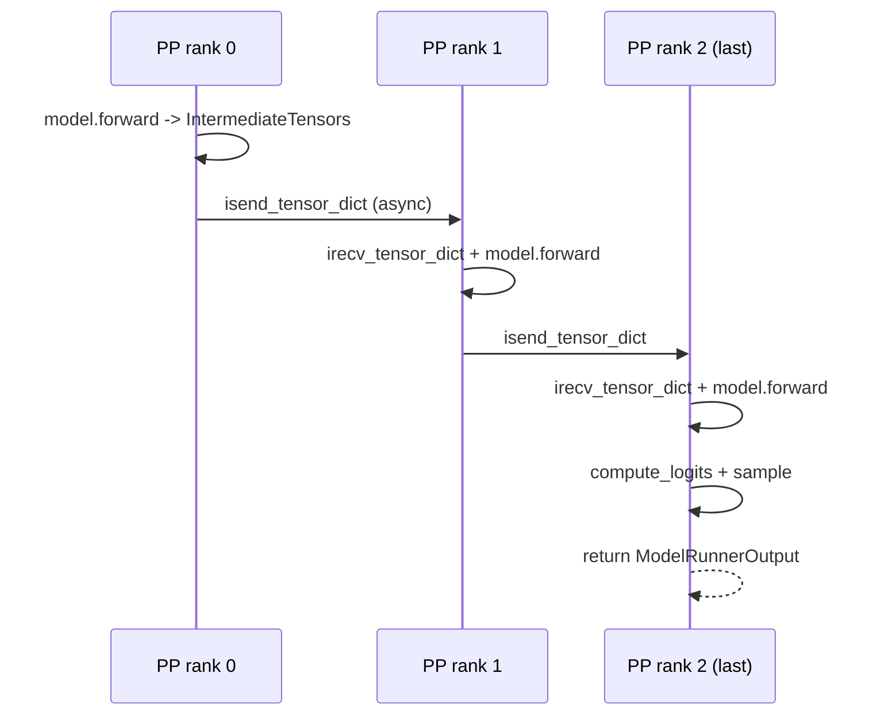
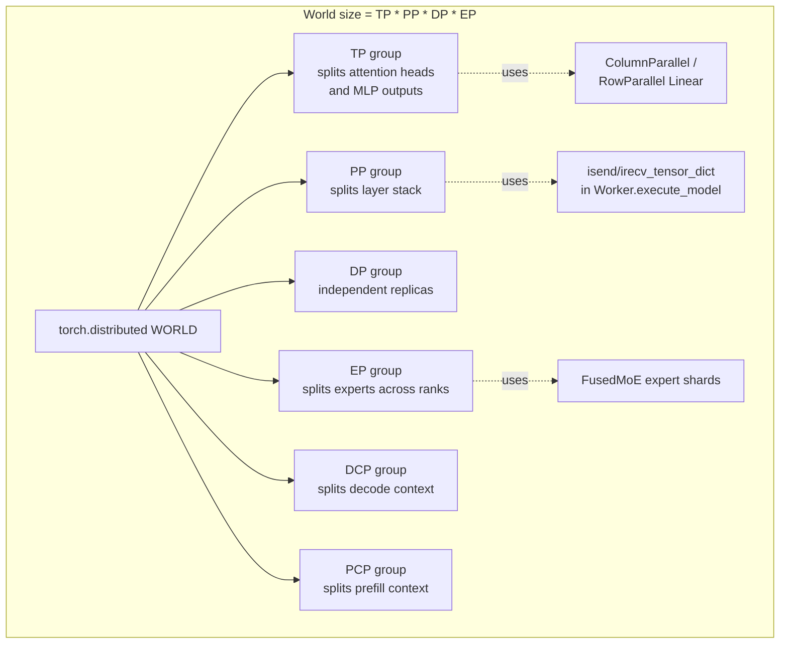

# Day 8 — Quantization & Parallelism (TP, PP, DP, EP, CP)

**By the end of today you will understand:** how vLLM's quantization configs are registered, discovered, and threaded into linear layers (with FP8 as a concrete walk-through); and how the parallelism infrastructure (tensor / pipeline / data / expert / context) is set up via process groups and consumed by the parallel-linear layers, PP send/recv, and DP/EP coordinators.

> Time budget: ~60 minutes (this day is dense — feel free to spread over two sessions).

Prereq: Day 2 (Llama linears + weight loader), Day 3 (MoE), Day 4 (attention layer).

## Part I — Quantization

### 1. Registry and discovery

`vllm/model_executor/layers/quantization/__init__.py`:

- Line 12–46: `QuantizationMethods` — the `Literal` type listing every supported method by name. Also includes deprecated methods (line 49–52).
- Line 55: `_CUSTOMIZED_METHOD_TO_QUANT_CONFIG` — a mutable dict for plugin registration.
- Line 58: `register_quantization_config(quantization: str)` — the decorator external plugins use to register a new `QuantizationConfig` subclass.
- Line 108: `get_quantization_config(quantization: str) -> type[QuantizationConfig]` — lazy-imports each config class and builds `method_to_config`, overlays online shorthands, overlays custom registrations, returns the class.

### 2. The base contracts

`vllm/model_executor/layers/quantization/base_config.py`:

- `QuantizeMethodBase(ABC)` at `:20` — abstract `create_weights(layer, ...)` and `apply(layer, ...)`. Optional hooks: `embedding`, `tie_weights`, `process_weights_after_loading`.
- `QuantizationConfig(ABC)` at `:87` — abstract `get_name`, `get_supported_act_dtypes`, `get_min_capability`, `get_config_filenames`, `from_config`, `get_quant_method`. Optional `override_quantization_method` classmethod (line 140) is called during config detection.

Linear-specific bridge in `vllm/model_executor/layers/linear.py`:

- `LinearMethodBase(QuantizeMethodBase)` at `:141` — concrete factory for `LinearBase`. Two abstract methods:
  - `create_weights(layer, input_size_per_partition, output_partition_sizes, input_size, output_size, params_dtype, **extra)` at `:145`.
  - `apply(layer, x, bias=None) -> Tensor` at `:171`.
- `UnquantizedLinearMethod(LinearMethodBase)` at `:182` — the fallback (used when `quant_config is None`).

### 3. How `quant_config` gets threaded into a layer

`vllm/model_executor/layers/linear.py:231` — `LinearBase.__init__`:

```268:277:vllm/model_executor/layers/linear.py
        self.quant_config = quant_config
        ...
        if quant_config is None:
            self.quant_method = UnquantizedLinearMethod()
        else:
            self.quant_method = quant_config.get_quant_method(self, prefix=prefix)
```

Every parallel-linear subclass (`ColumnParallelLinear`, `RowParallelLinear`, `QKVParallelLinear`, `MergedColumnParallelLinear`) calls `super().__init__(quant_config=quant_config, ...)`, so the same one-line dispatch handles all of them. The model constructor threads `quant_config` down from `VllmConfig`.

### 4. End-to-end trace: `--quantization fp8`

```mermaid
flowchart TB
    CLI["CLI: --quantization fp8"] --> EA[EngineArgs.resolve_quantization_config]
    EA --> MC[ModelConfig.quantization = 'fp8']
    MC --> VQ[ModelConfig._verify_quantization]
    VQ --> ITER[iterate all methods,<br/>call override_quantization_method]
    ITER --> RES[resolve to canonical name 'fp8']
    RES --> GC[get_quantization_config('fp8')]
    GC --> CFG_CLS[Fp8Config class]
    CFG_CLS --> FROM[Fp8Config.from_config hf_quant_cfg]
    FROM --> INST[Fp8Config instance]
    INST --> MB[Model builder threads it<br/>into every QKVParallelLinear]
    MB --> LB[LinearBase.__init__]
    LB --> GQM[quant_config.get_quant_method]
    GQM --> METHOD[Fp8LinearMethod instance]
    METHOD --> CW[create_weights]
    METHOD --> APP[apply]
```

### 5. FP8 walk-through

`vllm/model_executor/layers/quantization/fp8.py`:

- `Fp8Config(QuantizationConfig)` at `:95`:
  - `__init__` at `:98` — reads `is_checkpoint_fp8_serialized`, `activation_scheme` in `{"static","dynamic"}`, `ignored_layers`, `weight_block_size` (validated to be 2-D; block-wise requires dynamic activations).
  - Class methods `get_name` (line 136), `get_supported_act_dtypes` (line 140, `[bf16, fp16]`), `get_min_capability` (line 144, `75` = Turing), `from_config` (line 156).
  - `get_quant_method(self, layer, prefix)` at `:175` — factory that returns:
    - `Fp8LinearMethod` for `LinearBase`
    - `Fp8MoEMethod` for `RoutedExperts`
    - `Fp8KVCacheMethod` for `Attention`

- `Fp8LinearMethod(LinearMethodBase)` at `:267`:
  - `__init__` at `:280` — reads `weight_block_size`, chooses activation/weight quant keys (`kFp8DynamicTokenSym` when cutlass fp8 GEMM supported, else per-tensor).
  - `create_weights` at `:322` — registers `weight` (fp8), `weight_scale` (per-tensor) or `weight_scale_inv` (block scale), `input_scale` (for static activation); calls `init_fp8_linear_kernel(...)` at `:387` to pick the kernel (Marlin vs. cutlass scaled-mm).
  - `process_weights_after_loading` at `:398` — canonicalizes weights (transpose to `(K, N)`), reduces logical shards to a single tensor via `process_fp8_weight_tensor_strategy`, freezes `input_scale`.
  - `apply` at `:446` — dispatches to `self.fp8_linear.apply_weights(layer, x, bias)`. Special `VLLM_BATCH_INVARIANT` path dequantizes to bf16.

- `Fp8MoEMethod(FusedMoEMethodBase)` at `:492` — same pattern for MoE experts.
- `Fp8KVCacheMethod(BaseKVCacheMethod)` at `:857` — KV-cache-scale management for fp8 attention.

### 6. Other quantization backends

Enumerated in `vllm/model_executor/layers/quantization/`:

| Backend | Entry | Notes |
| --- | --- | --- |
| `auto_awq.py` | `AutoAWQConfig` :170 | AWQ / AWQ-Marlin (INT4 weight-only) |
| `auto_gptq.py` | `AutoGPTQConfig` :97 | GPTQ / GPTQ-Marlin |
| `awq_triton.py` | Triton AWQ kernels | Dispatched by AWQ configs |
| `bitsandbytes.py` | `BitsAndBytesConfig` :49 | 4-bit / 8-bit BnB, no calibration |
| `compressed_tensors/` | `CompressedTensorsConfig` :79 | Neural Magic; mixed W/A schemes (fp8/int8/int4/nvfp4/mxfp8) |
| `experts_int8.py` | `ExpertsInt8Config` :22 | INT8 for MoE experts only (deprecated) |
| `fbgemm_fp8.py` | `FBGEMMFp8Config` :45 | Meta FBGEMM (deprecated) |
| `fp_quant.py` | `FPQuantConfig` :30 | HIGGS-style (deprecated) |
| `fp8.py` | `Fp8Config` :95 | FP8 W8A8 (see walkthrough above) |
| `humming.py` | `HummingConfig` :170 | Vendor-specific |
| `inc/` | `INCConfig` :32 | Intel Neural Compressor |
| `modelopt.py` | `ModelOpt*Config` | NVIDIA TensorRT-Model-Optimizer (FP8, NVFP4, MXFP8, mixed) |
| `moe_wna16.py` | `MoeWNA16Config` :34 | Weight-only INT4/INT8 MoE |
| `mxfp4.py` | `Mxfp4Config` :40, `GptOssMxfp4Config` :102 | 4-bit MXFP4 (OCP MX format) |
| `online/` | `OnlineQuantizationConfig` :74 | Runtime quantization without pre-quant checkpoint |
| `quark/` | `QuarkConfig` :54 | AMD Quark format |
| `torchao.py` | `TorchAOConfig` :134 | Wrapper around torchao's quantized tensor subclasses |
| `turboquant/` | `TurboQuantConfig` :45 | TurboQuant kernels |

Documentation index: `docs/features/quantization/README.md`.

## Part II — Parallelism

### 7. Process groups

`vllm/distributed/parallel_state.py` — the process-group setup.

- `class GroupCoordinator` at `:351` — each parallelism dimension has one. Owns the device/CPU groups, communicators, and provides `all_reduce`, `all_gather`, `broadcast_tensor_dict`, `send_object`, `send_tensor_dict`, `barrier`, etc.
- Group getters (all assert-initialized):
  - `get_tp_group()` at `:1349`
  - `get_pp_group()` at `:1365`
  - `get_dp_group()` at `:1373`
  - `get_ep_group()` at `:1381`
  - `get_dcp_group()` at `:1357` (decode context parallel)
  - `get_pcp_group()` at `:1405` (prefill context parallel)
  - `get_eplb_group()` at `:1393`
- Initialization: `init_distributed_environment(...)` at `:1536` and `initialize_model_parallel(...)` at `:1694`. The docstring at line 1694–1723 shows a `[TP=2, PP=4]` example.
- Cleanup: `destroy_model_parallel` at `:2028`, `cleanup_dist_env_and_memory` at `:2077`.

### 8. Communication ops

`vllm/distributed/communication_op.py` — the thin functional wrappers:

```12:14:vllm/distributed/communication_op.py
def tensor_model_parallel_all_reduce(input_):
    """All-reduce the input tensor across model parallel group."""
    return get_tp_group().all_reduce(input_)
```

Also `tensor_model_parallel_all_gather` (line 17), `tensor_model_parallel_reduce_scatter` (line 24), `tensor_model_parallel_gather` (line 31), `broadcast_tensor_dict` (line 38).

### 9. Device communicators

`vllm/distributed/device_communicators/`:

| File | Role |
| --- | --- |
| `base_device_communicator.py` | `DeviceCommunicatorBase` ABC |
| `cuda_communicator.py` | CUDA path (NCCL + optional custom-AR / pynccl / symm_mem / FlashInfer) |
| `cpu_communicator.py` | Gloo backend for CPU workers |
| `xpu_communicator.py` | Intel XPU |
| `ray_communicator.py` | Ray-backed (control plane via RPC) |
| `cuda_wrapper.py` | ctypes wrapper for libcuda (IPC, device init) |
| `pynccl.py` / `pynccl_wrapper.py` | Python-level NCCL bindings |
| `pynccl_allocator.py` | Symmetric-memory-friendly CUDA allocator |
| `custom_all_reduce.py` | vLLM's custom NVLink/P2P small-tensor AR |
| `quick_all_reduce.py` | Alternate small-message AR |
| `flashinfer_all_reduce.py` | FlashInfer AR |
| `symm_mem.py` | CUDA symmetric-memory AR/AG (Hopper/Blackwell) |
| `mnnvl_compat.py` | Multi-Node NVLink helpers |
| `shm_broadcast.py` | POSIX-shared-memory broadcast queues |
| `shm_object_storage.py` | Shared-memory object store |
| `all2all.py` | Pluggable all-to-all backends for EP / MoE |

### 10. TP: the parallel-linear layers

`vllm/model_executor/layers/linear.py`. Key classes:

| Class | Line | Sharding |
| --- | --- | --- |
| `ReplicatedLinear` | 292 | No sharding (used for the MoE router) |
| `ColumnParallelLinear` | 397 | Splits output dim across TP; requires all-gather to reconstruct full output (or leaves it sharded) |
| `MergedColumnParallelLinear` | 580 | Column-parallel with multiple logical outputs fused (`gate_up`) |
| `QKVParallelLinear` | 942 | Column-parallel producing (Q, K, V) per rank; head-count aware |
| `RowParallelLinear` | 1541 | Splits input dim; all-reduce after the matmul |

The pattern is:
- **Column-parallel** for the first linear of a block (Q/K/V and gate/up). Each rank owns a slice of the output.
- **Row-parallel** for the last linear (o_proj and down_proj). Each rank owns a slice of the input; the outputs are all-reduced.

Combined, `ColumnParallel(RowParallel(x))` needs one all-reduce per attention/MLP block per layer.

### 11. Vocab-parallel embedding

`vllm/model_executor/layers/vocab_parallel_embedding.py`:

- `VocabParallelEmbedding` at `:198` — shards vocab dim across TP. Each rank owns a slice; `forward` at `:472` does masked embed then all-reduce.
- `ParallelLMHead(VocabParallelEmbedding)` at `:505` — the LM head. Tied to embedding when applicable, sharded across TP.
- Helpers: `pad_vocab_size` (line 87), `vocab_range_from_per_partition_vocab_size` (line 92), `vocab_range_from_global_vocab_size` (line 100), `get_masked_input_and_mask` (line 169).

### 12. Pipeline parallelism

Split the layer stack across PP ranks. Each rank owns a contiguous slice. The **model side**:

- `vllm/model_executor/models/utils.py:685` — `make_layers(num_hidden_layers, layer_fn, prefix)`. It calls `get_pp_indices(num_hidden_layers, get_pp_group().rank_in_group, get_pp_group().world_size)` (line 705) to compute this rank's contiguous slice, fills the rest with `PPMissingLayer` placeholders (line 709) so parameter names still line up.
- `PPMissingLayer` at `utils.py:680`.
- `SupportsPP` protocol at `vllm/model_executor/models/interfaces.py:617` — every PP-capable model implements `make_empty_intermediate_tensors(batch_size, dtype, device)` (line 629) and `forward(input_ids, positions, *, intermediate_tensors)` (line 638).

The **worker side**: `Worker.execute_model` at `vllm/v1/worker/gpu_worker.py:955-1043`.



Key line: `Worker.execute_model` at `gpu_worker.py:1015` calls the model; at `:1029-1041`, non-last PP ranks forward the output via `get_pp_group().isend_tensor_dict(output.tensors, all_gather_group=get_tp_group(), ...)` and return `None`.

### 13. Data parallelism

The DP variant of the engine core process is `DPEngineCoreProc` at `vllm/v1/engine/core.py:1745`. Each DP replica runs its own copy of the model; DP ranks share a coordinator for micro-batching decisions.

`vllm/v1/worker/dp_utils.py` — DP synchronization helpers used per-step:

- `_get_device_and_group(parallel_config)` at `:18` — chooses NCCL vs. CPU-gloo for the sync tensor.
- `_run_ar(...)` at `:36` — small all-reduce that packs ubatch-should-run flags + padded token counts.
- `coordinate_batch_across_dp(...)` at `:164` — the main per-step entry the model runner uses to decide batch shape.

Doc: `docs/serving/data_parallel_deployment.md`.

### 14. Expert parallelism (EP)

`vllm/distributed/eplb/` — the Expert-Parallel Load Balancer:

- `eplb_state.py` — `EplbState` at `:219`, orchestrates:
  - `EplbStats` at `:64` (rolling load counters).
  - `EplbModelState` at `:93` (per-model expert layout).
  - Methods: `build_initial_global_physical_to_logical_map`, `validate_ep_configuration`, `add_model`, `prepare_forward`, `step`, `rearrange` (line 721), `start_async_loop`, `drain_async`.
- `eplb_communicator.py` — pluggable transport for expert-weight swaps: `EplbCommunicator` ABC at `:45`; concrete implementations for `TorchDistNcclEplbCommunicator` (line 98), `TorchDistGlooStagedEplbCommunicator` (line 155), `NixlEplbCommunicator` (line 241), `PyNcclEplbCommunicator` (line 614).
- `rebalance_execute.py` — the actual weight-swap plumbing (`transfer_layer` at `:427`, `rearrange_expert_weights_inplace` at `:511`).
- `async_worker.py` — background thread that runs the transfer schedule (`start_async_worker` at `:24`).

Doc: `docs/serving/expert_parallel_deployment.md`.

### 15. Context parallelism (CP)

Two flavors:

- **DCP** (decode context parallel) — shard along the T dimension for long decode contexts. Group at `get_dcp_group()`.
- **PCP** (prefill context parallel) — ring-attention style for long prefills. Group at `get_pcp_group()`.

Compatibility check: `vllm/v1/worker/cp_utils.py:14` — `check_attention_cp_compatibility(vllm_config)` enforces that the attention backend supports LSE-returning decode (for DCP) and `supports_pcp` (for PCP).

Doc: `docs/serving/context_parallel_deployment.md`.

## 16. Diagram: parallelism dimensions



## 17. Comprehension checks

1. Why is the MoE router `ReplicatedLinear` and not `ColumnParallelLinear`? What communication does that avoid?
2. In `LlamaAttention`, `qkv_proj` is `QKVParallelLinear` (column-parallel) and `o_proj` is `RowParallelLinear`. Why this combination? Where is the single all-reduce per attention block?
3. When TP=8 and PP=2 and DP=2, how many total processes run? How many `Worker` instances? Which coordinator decides how they cooperate per step? (Hint: `MultiprocExecutor`, `DPEngineCoreProc`.)
4. What is the difference between `override_quantization_method` and `get_quant_method`? Which one runs at engine startup, and which per layer?
5. If a Fp8-checkpointed model has some layers listed in `ignored_layers`, which method is used for those layers? (Trace `Fp8Config.get_quant_method` at `:175`.)

## 18. Hands-on exercise

**A. Quantization**: Open `vllm/model_executor/layers/quantization/fp8.py:322` (`Fp8LinearMethod.create_weights`). Predict:

1. For `Fp8Config(activation_scheme="dynamic", weight_block_size=None)`, what parameters get registered on the layer?
2. For `Fp8Config(activation_scheme="static")`, what additional parameter shows up? Where does its value come from in the checkpoint?
3. What does `process_weights_after_loading` do to `weight` if `weight_block_size` is `[128, 128]`? What if it's `None`?

Verify by reading lines 398–444.

**B. Parallelism**: Open `vllm/model_executor/models/llama.py:333` (`LlamaModel.__init__`) and `vllm/model_executor/models/utils.py:685` (`make_layers`). Predict:

1. With `PP=2` and `num_hidden_layers=32`, what does `layers` look like on PP rank 1?
2. What is `self.start_layer` and `self.end_layer` on PP rank 1?
3. What would break if you removed `PPMissingLayer` and just made `layers` shorter on each rank?

Verify by finding `PPMissingLayer` at `utils.py:680` and where it's used inside `LlamaModel.forward` at line 400.

Tomorrow (Day 9): the training story for draft models (in-repo? out-of-repo? what's in the loaders?) and structured / guided decoding.
