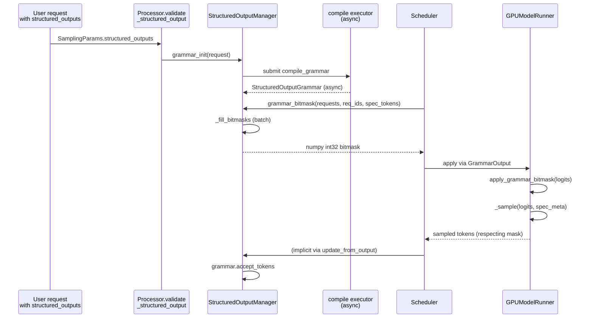

# Day 9 — Draft-Model Training (what's in the repo) & Structured / Guided Decoding

**By the end of today you will understand:** exactly what vLLM does and does *not* do about draft-model training (spoiler: it consumes external checkpoints and never trains one itself), which external tools/formats the loaders recognize, and how the structured-output (grammar / JSON schema / regex) system works — from `StructuredOutputManager` down to the per-token bitmask applied at sampling time.

> Time budget: ~55 minutes.

Prereq: Day 6 (spec-decode framework), Day 7 (methods).

## Part I — Draft-model training: what the repo actually says

### 1. Bottom line

**vLLM does not train draft models.** The repo is inference-only. Every draft head, EAGLE checkpoint, MTP layer, Medusa head, and MLP speculator you'll see referenced was trained by an external tool. What's *in* the repo:

- Runtime proposer implementations (Day 6-7).
- Config detectors and HF-config rewriters that recognize external formats.
- Loaders that convert those formats into vLLM's model classes.

If your work needs to fine-tune or train a new draft model, you'll leave this repo and use one of the external tools below.

### 2. The one canonical external training tool: `vllm-project/speculators`

`docs/features/speculative_decoding/speculators.md` — the landing page for the training library the vLLM docs officially recommend. Direct quotes from the doc:

> "Speculators is a library for accelerating LLM inference through speculative decoding, providing efficient draft model training that integrates seamlessly with vLLM to reduce latency and improve throughput."
>
> Key features listed: "**Offline training data generation using vLLM**", "**Draft model training support**: E2E training support of single and multi-layer draft models. Training is supported for both non-MoE and MoE models.", "**Standardized, extensible format**", "**Seamless vLLM Integration**".

GitHub: `https://github.com/vllm-project/speculators`. **vLLM only consumes speculators-format checkpoints; it does not produce them.**

Loader side (in this repo):

- `vllm/transformers_utils/configs/speculators/base.py:15` — `SpeculatorsConfig(PretrainedConfig)` with `model_type = "speculators"`. Its `from_pretrained` (line 33) reads the checkpoint's `speculators_model_type` and dispatches to one of four algorithm updaters:
- `vllm/transformers_utils/configs/speculators/algos.py`:
  - `eagle3` at `:15`
  - `peagle` at `:55` (parallel-eagle → PARD)
  - `dflash` at `:93`
  - `dspark` at `:125`

Each updater rewrites the HF config so vLLM sees `architectures: ["Eagle3Qwen3ForCausalLM"]` or `["DFlashDraftModel"]` or similar, and the normal model registry picks up the class.

### 3. Other external training sources referenced by the code

- **SafeAILab/EAGLE** — the original EAGLE research repo. The only reference in vLLM is an inline comment link in `vllm/model_executor/models/llama_eagle.py:41` explaining that the vLLM `LlamaDecoderLayer` variant skips `input_layernorm` "to match SafeAILab/EAGLE". `docs/features/speculative_decoding/eagle.md` also points at legacy checkpoints from `yuhuili/models` (the EAGLE author's HF page) plus a gist-based script for converting pre-vLLM-0.7 EAGLE formats.

- **`FasterDecoding/Medusa`** — cited in `vllm/model_executor/models/medusa.py:43` as the reference implementation. Old-format FasterDecoding checkpoints get `model_type: "medusa"` injected by `vllm/config/speculative.py:731-737` so the standard loader picks them up.

- **IBM AI Platform / IBM Granite** — pre-trained MLP-speculator checkpoints. `docs/features/speculative_decoding/mlp.md:40-48` lists eight HF-hub checkpoints (`ibm-ai-platform/llama-13b-accelerator`, etc., plus `ibm-granite/*-accelerator`). Paper 2404.19124.

- **AMD PARD** — pre-trained parallel-draft-model checkpoints at `amd/PARD-*` on HF hub (`docs/features/speculative_decoding/parallel_draft_model.md:46`). Loaded via `SpeculatorsConfig` with `speculators_model_type="peagle"` or directly via `method="draft_model", parallel_drafting=true`.

- **Snowflake Arctic Inference** — suffix decoding: `pip install arctic-inference`. Loaded lazily in `vllm/v1/spec_decode/suffix_decoding.py:26`. The trie itself lives outside vLLM.

- **`sgl-project/SpecForge`** — mentioned only in passing: `vllm/benchmarks/datasets/datasets.py:4445` cites a SpecForge PR for the MMStar dataset comment (unrelated to training). No SpecForge-format loader.

- **SGLang deepseek_nextn** — cited in `vllm/model_executor/models/deepseek_mtp.py:126` as a correctness reference for matching the MTP recycle pattern.

### 4. What the loaders expect (by method)

- **EAGLE / EAGLE-3**: either the speculators format (via `SpeculatorsConfig`) or a plain HF checkpoint wrapped in `EAGLEConfig` (`vllm/config/speculative.py:822-840`). Weight loading uses `process_eagle_weight` at `vllm/model_executor/models/utils.py:915` which watches for `lm_head` / `embed_tokens` in the state dict and toggles `has_own_lm_head` / `has_own_embed_tokens` accordingly. Weight sharing decisions happen in `_maybe_share_embeddings` (`llm_base_proposer.py:1410`) and `_maybe_share_lm_head` (`:1479`).

- **MTP**: expects the MTP layers to be part of the target checkpoint at indices `[num_hidden_layers, num_hidden_layers + n_predict)` with `num_nextn_predict_layers` on the HF config. `hf_config_override` at `vllm/config/speculative.py:321` auto-rewrites `deepseek_v3` / `deepseek_v32` / `glm_moe_dsa` / `pangu_ultra_moe` → the corresponding MTP `model_type`.

- **Medusa**: old-format checkpoints get `model_type: "medusa"` injected (`config/speculative.py:731`); modern ones use `MedusaConfig.from_pretrained`.

- **DFlash / DSpark / PEagle (PARD)**: loaded through `SpeculatorsConfig` → algorithm updater. `dflash` / `dspark` also set `parallel_drafting=True` (`config/speculative.py:853`).

- **MLP speculators**: loaded directly from IBM's HF checkpoints; config carries `n_predict`, `emb_dim`, `inner_dim`, `num_lookahead_tokens`.

- **N-gram / Suffix**: no checkpoint. Drafts come from the request's own tokens (ngram) or Arctic Inference's trie (suffix).

### 5. Open questions (open in the repo, not just for the reader)

Two areas where the code says "not fully validated" or "external dependency":

- Dynamic SD is documented as **only tested with EAGLE / EAGLE-3, MRv1 only**. See `docs/features/speculative_decoding/dynamic_speculative_decoding.md`. If you set it up with a different method you may get incorrect drafts.
- Suffix decoding requires `arctic-inference` which is not a hard dependency; the import is lazy and will surface only when a request tries to use it.

### 6. One-sentence summary you should be able to recite

> "vLLM never trains draft models in-repo; it consumes external checkpoints via `SpeculatorsConfig` (EAGLE-3, PARD, DFlash, DSpark), model-specific HF configs (MTP), or dedicated wrappers (Medusa, MLP-speculator, Arctic Inference for suffix decoding), and the officially recommended training tool is the sibling project `vllm-project/speculators`."

## Part II — Structured / guided decoding

Documentation entrypoint: `docs/features/structured_outputs.md`.

### 7. User-facing types

`vllm/sampling_params.py:72` — `StructuredOutputsParams`:

```71:88:vllm/sampling_params.py
@dataclass
class StructuredOutputsParams:
    json: str | dict | None = None
    regex: str | None = None
    choice: list[str] | None = None
    grammar: str | None = None
    json_object: bool | None = None
    disable_any_whitespace: bool = False
    disable_additional_properties: bool = False
    whitespace_pattern: str | None = None
    structural_tag: str | None = None
    _backend: str | None = field(default=None, init=False)
    _backend_was_auto: bool = field(default=False, init=False)
```

`__post_init__` (line 90) enforces mutual exclusion: exactly one of `json`, `regex`, `choice`, `grammar`, `json_object`, or `structural_tag` must be set. `_backend` is stamped by `Processor._validate_structured_output`.

The `StructuredOutputOptions` enum at `vllm/v1/structured_output/backend_types.py:19`:

```19:25:vllm/v1/structured_output/backend_types.py
class StructuredOutputOptions(enum.Enum):
    JSON = "json"
    JSON_OBJECT = "json_object"
    REGEX = "regex"
    GRAMMAR = "grammar"
    CHOICE = "choice"
    STRUCTURAL_TAG = "structural_tag"
```

### 8. Backend contracts

`vllm/v1/structured_output/backend_types.py`:

- `StructuredOutputGrammar(ABC)` at `:31` — per-request FSM. Required methods:
  - `accept_tokens(request_id, tokens) -> bool` at `:35`
  - `validate_tokens(tokens) -> list[int]` at `:49`
  - `rollback(num_tokens)` at `:63`
  - `fill_bitmask(bitmask, batch_index)` at `:73`
  - `is_terminated()` at `:83`
  - `reset()` at `:92`

- `StructuredOutputBackend(ABC)` at `:98` — engine-level. Fields `vllm_config`, `tokenizer`, `vocab_size`. Abstract methods:
  - `compile_grammar(request_type, grammar_spec) -> StructuredOutputGrammar` at `:107`
  - `allocate_token_bitmask(max_num_seqs) -> torch.Tensor` at `:122`
  - `destroy()` at `:132`

### 9. The four concrete backends

| Backend | File | Config choice |
| --- | --- | --- |
| xgrammar (default; C++/CUDA) | `backend_xgrammar.py` | `structured_outputs_config.backend = "xgrammar"` |
| Outlines | `backend_outlines.py` | `"outlines"` |
| LM Format Enforcer | `backend_lm_format_enforcer.py` | `"lm_format_enforcer"` |
| llguidance ("guidance") | `backend_guidance.py` | `"guidance"` |

#### 9a. xgrammar

`vllm/v1/structured_output/backend_xgrammar.py`:

- `XgrammarBackend` at `:36` — constructs an `xgr.TokenizerInfo` (Mistral / Tekken special path at `:42`-`59`, standard HF at `:61`-`64`). Builds `xgr.GrammarCompiler` at `:65` with cache size `VLLM_XGRAMMAR_CACHE_MB`.
- `compile_grammar` at `:78` — dispatches on `StructuredOutputOptions`:
  - JSON → `compile_json_schema`
  - GRAMMAR → `compile_grammar`
  - REGEX → `compile_regex_with_timeout`
  - STRUCTURAL_TAG → `compile_structural_tag`
  - Returns `XgrammarGrammar(matcher=xgr.GrammarMatcher(ctx, max_rollback_tokens=num_speculative_tokens))`.
- `allocate_token_bitmask` at `:128` → `xgr.allocate_token_bitmask(max_num_seqs, vocab_size)`.
- `XgrammarGrammar` at `:136` wraps the `xgr.GrammarMatcher`. `accept_tokens` advances the C++ FSM (`matcher.accept_token`); `fill_bitmask` at `:195` calls `self.matcher.fill_next_token_bitmask(bitmask, idx)`. **Fastest backend**, C++/CUDA masking with in-place output.

#### 9b. Outlines

`vllm/v1/structured_output/backend_outlines.py`:

- `OutlinesBackend` at `:53` — builds an `oc.Vocabulary` from the tokenizer once (`get_outlines_vocabulary` at `:55`) and a disk-backed compiled-regex cache (`get_outlines_cache` at `:56`). `_compile_index(regex_string, vocabulary)` (line 58) turns regex → `oc.Index` (cached by `f"{vocabulary._hash}_{regex_string}"`).
- `compile_grammar` at `:73` — converts JSON → regex via `outlines_core.json_schema.build_regex_from_schema`; CHOICE → alternation regex; REGEX passthrough. **No GRAMMAR support.**
- Returns `OutlinesGrammar(vocab_size, guide=oc.Guide(index, max_rollback=num_spec))`.
- `OutlinesGrammar.fill_bitmask` at `:155` writes directly into the tensor via raw pointer: `self.guide.write_mask_into(mask.data_ptr(), mask.numel(), mask.element_size())`. Has a `_prev_finished` flag (line 121) to defer termination by one step so EOS can still be emitted.

#### 9c. LM Format Enforcer

`vllm/v1/structured_output/backend_lm_format_enforcer.py`:

- `_cached_build_vllm_token_enforcer_tokenizer_data(tokenizer, vocab_size)` at `:34` — `@lru_cache`d call into `lmfe_vllm.build_vllm_token_enforcer_tokenizer_data(..., use_bitmask=True)`.
- `LMFormatEnforcerGrammar` at `:43` — Python-level FSM keeping `current_tokens_prefix: list[int]`. `accept_tokens` walks each token through `token_enforcer.get_allowed_tokens(prefix).is_token_allowed(token)`. `fill_bitmask` at `:75` copies the enforcer's per-step `allowed_tokens.allowed_tokens` field straight into `bitmask[batch_index]`.
- `LMFormatEnforcerBackend` at `:94` — chooses a `CharacterLevelParser` (`JsonSchemaParser`, `RegexParser`, `UnionParser(StringParser...)`) at `:100`-`119`. **Does not support speculative decoding** (raises at `:126`-`129` if `max_rollback_tokens > 0`).

#### 9d. llguidance ("guidance")

`vllm/v1/structured_output/backend_guidance.py`:

- `GuidanceBackend` at `:87` — builds `LLTokenizer` from HF tokenizer (or Mistral's built-in at `:96-97`). `compile_grammar` at `:103` first serializes the request to llguidance JSON via `serialize_guidance_grammar(...)` (`:106`-`111`), then instantiates `llguidance.LLMatcher(...)` at `:113`, and returns a `GuidanceGrammar` wrapping it.
- `allocate_token_bitmask` at `:128` → `llguidance_torch.allocate_token_bitmask`.
- `GuidanceGrammar` at `:138` — advances the matcher with `ll_matcher.consume_tokens(tokens)` (line 175). Guards a special "rollback_lag" case around EOS (lines 160-165, 199-203) so EOS still generates when the parser has stopped. `fill_bitmask` at `:205` calls `llguidance_torch.fill_next_token_bitmask(self.ll_matcher, bitmask, idx)`.

### 10. `StructuredOutputManager` — the engine-side orchestrator

`vllm/v1/structured_output/__init__.py:36` — `class StructuredOutputManager`:

- `__init__` at `:39` — creates optional async grammar-compile executor (line 78) and parallel-bitmask executor (line 62, batches above threshold 128); caches tokenizer.
- `_get_reasoner(request)` at `:100` — returns a reasoning parser (only enforce bitmask outside the thinking region).
- `grammar_init(request)` at `:115` — compiles a grammar (or submits an async future) for a new request.
- `_fill_bitmasks(batch)` at `:186` — for each (grammar, index, apply) tuple either `grammar.fill_bitmask(...)` or writes all-1s.
- `grammar_bitmask(requests, structured_output_request_ids, scheduled_spec_decode_tokens)` at `:204` — **the main API** called from `Scheduler.get_grammar_bitmask`:
  - Allocates `_grammar_bitmask` on first call: `backend.allocate_token_bitmask(max_batch_size * (1 + max_num_spec_tokens))` (line 217).
  - Serial path (lines 263-294) advances each request's FSM through spec tokens with rollback, filling per-position bitmasks.
  - Returns a `numpy.ndarray[int32]` (line 303) for cheap serialization to workers.

### 11. Per-request grammar state

`vllm/v1/structured_output/request.py:21`:

```21:74:vllm/v1/structured_output/request.py
@dataclasses.dataclass
class StructuredOutputRequest:
    params: StructuredOutputsParams
    _grammar: Future[StructuredOutputGrammar] | StructuredOutputGrammar | None = None
    reasoning_ended: bool | None = None
    reasoning_parser_kwargs: dict | None = None
    reasoner: ReasoningParser | None = None

    @classmethod
    def from_sampling_params(cls, sampling_params):
        ...

    def _check_grammar_completion(self):
        ...
```

`_check_grammar_completion` at `:42` non-blockingly polls the compile future with a 100 µs timeout; on success it flips the request status to `WAITING`.

### 12. How the bitmask gets applied at sampling

`vllm/v1/structured_output/utils.py`:

- `apply_grammar_bitmask(scheduler_output, grammar_output, input_batch, logits)` at `:85` — reorders the compacted bitmask to the model runner's batch order (lines 112-140), copies async to device (line 143), then calls `xgr.apply_token_bitmask_inplace(logits, grammar_bitmask, indices=...)` (line 160 GPU / lines 170-174 CPU with float32 fallback for older xgrammar).

Call sites:

- `GPUModelRunner.sample_tokens` at `vllm/v1/worker/gpu_model_runner.py:4462`:

```4462:4469:vllm/v1/worker/gpu_model_runner.py
        if grammar_output is not None:
            apply_grammar_bitmask(
                scheduler_output, grammar_output, self.input_batch, logits)

        with record_function_or_nullcontext("gpu_model_runner: sample"):
            sampler_output = self._sample(logits, spec_decode_metadata)
```

- `Scheduler.get_grammar_bitmask` at `vllm/v1/core/sched/scheduler.py:1469` — the scheduler-side entry that packages the numpy bitmask into a `GrammarOutput` (defined at `vllm/v1/core/sched/output.py:263`).

### 13. Diagram: structured decoding lifecycle



### 14. Interaction with spec decode

`StructuredOutputManager.grammar_bitmask` accepts `scheduled_spec_decode_tokens` (a dict of per-request draft tokens) and, for each request:

- Advances the FSM through each spec token.
- Fills a per-position bitmask.
- Rolls back after the step (`grammar.rollback` and `grammar.validate_tokens`).

Rejected drafts get rolled back too, in the deferred-validation path via `Scheduler.update_draft_token_ids_in_output` at `vllm/v1/core/sched/scheduler.py:1951`.

Note: LM Format Enforcer does NOT support spec decode (raises at `backend_lm_format_enforcer.py:126` if `max_rollback_tokens > 0`).

### 15. Interaction with reasoning models

For thinking-model outputs, the manager reads the `reasoner` from `StructuredOutputRequest` and enforces the bitmask only *outside* the thinking region. See `StructuredOutputManager.should_fill_bitmask` at `:305` and `should_advance` at `:325`.

Docs: `docs/features/reasoning_outputs.md`.

## 16. Comprehension checks

1. Why is the bitmask a per-token `int32` packed array (32 vocab entries per int) rather than a boolean tensor?
2. What is the difference between `StructuredOutputBackend.allocate_token_bitmask` and `StructuredOutputManager._grammar_bitmask`? Which is per-call and which is per-backend?
3. Why does LM Format Enforcer refuse to work with spec decode? (Hint: `max_rollback_tokens > 0`.)
4. When a request has both structured output AND spec decode, how does the manager know to roll back the FSM after each rejected draft? (Trace `grammar.validate_tokens` and `grammar.rollback`.)
5. If your draft model was trained by `vllm-project/speculators`, which class in vLLM reads its config? Which class instantiates its `nn.Module`?

## 17. Hands-on exercise

**A. Training story**: skim `docs/features/speculative_decoding/speculators.md` and `docs/features/speculative_decoding/eagle.md`. Then find:

1. Where in the code does the EAGLE checkpoint format get detected? (Trace `SpeculatorsConfig.from_pretrained` at `vllm/transformers_utils/configs/speculators/base.py:33`.)
2. How does the loader know whether the EAGLE head has its own `lm_head`? (Trace `process_eagle_weight` at `vllm/model_executor/models/utils.py:915`.)

**B. Structured decoding**: open `vllm/v1/structured_output/backend_xgrammar.py` and `vllm/v1/structured_output/utils.py:85`. Predict:

1. If a user submits a JSON-schema-constrained request with `n=1` and `num_speculative_tokens=4`, how large is the allocated `_grammar_bitmask` tensor?
2. During a step where 3 of the 4 drafts get rejected, what does the FSM state look like at the end (before / after `grammar.rollback`)?

Verify by finding the `rollback_lag` handling in `structured_output/__init__.py:263-294`.

Tomorrow (Day 10): synthesis — trace one full request end-to-end, and gather the open questions.
