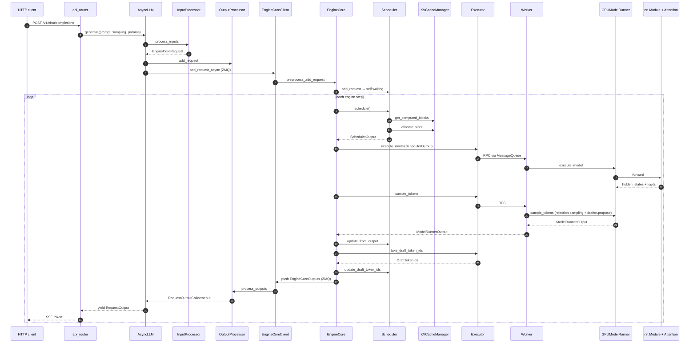

# Day 10 — Synthesis: End-to-End Trace + Open Questions

**By the end of today you will:** trace a single prompt from HTTP request all the way through KV allocation, attention execution, sampling, and back to the SSE stream in one continuous mental model; understand which features are compatible with which (constraints & incompatibilities the code enforces); and have a curated list of "next places to dig" and open questions.

> Time budget: ~45 minutes. Then re-read your notes.

## 1. The prompt: "Explain PagedAttention in one sentence." with EAGLE-3, prefix caching on, chunked prefill on

Setup: Llama 3 70B target, EAGLE-3 draft head, TP=4, prefix caching enabled, chunked prefill enabled, `--max-num-batched-tokens=8192`, one client hitting `POST /v1/chat/completions`. Trace by module.

### 1a. HTTP → engine (frontend process)

1. **FastAPI handler**: `POST /v1/chat/completions` route (`vllm/entrypoints/openai/chat_completion/api_router.py:40`). Delegates to `OpenAIServingChat.create_chat_completion` (`vllm/entrypoints/openai/chat_completion/serving.py:229`).

2. **Engine call**: at line 353, the handler calls

    ```
    generator = self.engine_client.generate(engine_input, sampling_params, request_id, ...)
    ```

    `engine_client` is an `AsyncLLM` from `vllm/v1/engine/async_llm.py:70`.

3. **`AsyncLLM.generate`** at `:524` calls `add_request` at `:280`:
    - `input_processor.process_inputs(...)` at `input_processor.py:242` — applies chat template, tokenizes, produces an `EngineCoreRequest`.
    - Creates a `RequestOutputCollector` (queue) for this request.
    - `_add_request(...)` at `:400`:
      - `output_processor.add_request(...)` at `output_processor.py:512` — registers a `RequestState`.
      - `await engine_core.add_request_async(request)` — ships the `EngineCoreRequest` over ZMQ to the EngineCore subprocess.

4. Back in `AsyncLLM.generate`, the code enters the `while True: token = await q.get(); yield token` loop.

### 1b. Engine core process picks up the request

5. `EngineCoreProc.process_input_sockets` (`vllm/v1/engine/core.py:1484`) deserializes the `EngineCoreRequest`, calls `preprocess_add_request` at `:855` which builds a `Request` object (`vllm/v1/request.py:59`) via `Request.from_engine_core_request` at `:198`. Enqueues onto `EngineCoreProc.input_queue`.

6. On the next iteration of `run_busy_loop` at `:1259`, `_process_input_queue` drains the queue and calls `EngineCore.add_request(request)` at `:372`, which calls `self.scheduler.add_request(request)` at `scheduler.py:1993`. The request lands in `self.waiting`.

### 1c. First step: prefill (or chunked prefill)

7. `EngineCore.step` at `:479` is called next.
    - `self.scheduler.schedule(...)` at `scheduler.py:393`:
      - **Phase 1 (running)**: no running requests yet.
      - **Phase 2 (waiting)**: pops our request. At line 719, `self.kv_cache_manager.get_computed_blocks(request)` is called. If the same prompt was served recently, prefix caching returns non-zero `num_new_computed_tokens`; otherwise zero.
      - **Chunked prefill decision** at lines 822–836: since chunked prefill is enabled, `num_new_tokens = min(prompt_len - num_new_computed_tokens, token_budget=8192)`. If the prompt is longer than 8192 tokens, only the first 8192 run this step.
      - `self.kv_cache_manager.allocate_slots(request, num_new_tokens)` at `kv_cache_manager.py:244` allocates blocks. `BlockPool.get_new_blocks` at `block_pool.py:542` pulls from the free queue.
      - Adds to `self.running` and sets `request.status = RUNNING`.
      - `_update_after_schedule` at `scheduler.py:1159`: sets `request.is_prefill_chunk = True` because `num_computed_tokens < num_tokens`.
    - Builds `SchedulerOutput` at `scheduler.py:1088`.

8. `self.model_executor.execute_model(scheduler_output, non_block=True)` at `core.py:491`.

### 1d. Executor → worker → runner (4 GPU processes for TP=4)

9. `MultiprocExecutor.execute_model` at `multiproc_executor.py:307` broadcasts `("execute_model", (scheduler_output,), {}, output_rank=3)` over the shared-mem MessageQueue.

10. On each of the 4 worker processes, `WorkerProc.worker_busy_loop` (`multiproc_executor.py:983`) dequeues the RPC and calls `Worker.execute_model(scheduler_output)` at `gpu_worker.py:955`:
    - Since PP=1, no receive step.
    - `GPUModelRunner.execute_model(scheduler_output)` at `gpu_model_runner.py:4047`:
      - `_update_states` at `:4089` — adds our request to the persistent batch.
      - `_prepare_inputs` at `:4131` — builds `input_ids`, `positions`, `logits_indices`, and (if any spec drafts scheduled) `SpecDecodeMetadata`. First step has no drafts.
      - `_build_attention_metadata` at `:4258` — the `FlashAttentionMetadataBuilder` (or whichever backend) turns `CommonAttentionMetadata` into per-layer `FlashAttentionMetadata` with `block_table` and `slot_mapping`.
      - `set_forward_context(...)` at `:4312` — makes `attn_metadata`, `kv_cache`, `slot_mapping` reachable to `unified_attention_with_output`.
      - `model.forward(input_ids, positions, ...)` — enters `LlamaForCausalLM.forward` at `llama.py:516`, then `LlamaModel.forward` at `:400`, then per-layer `LlamaDecoderLayer.forward` at `:310`.
      - Inside `LlamaAttention.forward` at `:221`: `qkv_proj → rotary_emb → attn(q,k,v) → o_proj`. `Attention.forward` at `attention.py:452` invokes `torch.ops.vllm.unified_kv_cache_update` (write KV) and `torch.ops.vllm.unified_attention_with_output` (attend). The custom op finds `kv_cache` for this layer in the forward context and calls `FlashAttentionImpl.forward` at `flash_attn.py:749`. All TP ranks compute their heads; `RowParallelLinear` in `o_proj` all-reduces.
      - `compute_logits` at `:4365` — `self.model.compute_logits(sample_hidden_states)` → `LogitsProcessor` produces logits for the last position of each request.
      - Stores `ExecuteModelState` and returns `None` (deferred sampling).

11. Back in `EngineCore.step`:
    - `grammar_bitmask = self.scheduler.get_grammar_bitmask(scheduler_output)` at `:492`. No structured output, so this is a no-op.
    - `model_output = self.model_executor.sample_tokens(grammar_output).result()` at `:499`. Rank 3 broadcasts the `ModelRunnerOutput` back.
    - Inside rank 3's `sample_tokens` at `gpu_worker.py:948` → `GPUModelRunner.sample_tokens` at `:4433`:
      - `_sample(logits, spec_decode_metadata=None)` at `:3573`: since no drafts on the first step, calls `self.sampler(logits, sampling_metadata)`.
      - `_update_states_after_model_execute` at `:4471`.
      - **Drafter proposal** — `propose_draft_token_ids` at `:4491`. Since this is EAGLE-3, `spec_config.use_eagle()` is True; the drafter's `propose` (`llm_base_proposer.py:501`) runs K forward passes reusing the target's aux hidden states. Draft tokens are stashed in `self._draft_token_req_ids` / `self._draft_token_ids_padded`.
      - Returns a `ModelRunnerOutput` (or `AsyncGPUModelRunnerOutput` wrapper).
    - `scheduler.update_from_output(scheduler_output, model_output)` at `:504`:
      - `_update_request_with_output` at `:1878` — appends the newly-sampled token, checks stop conditions via `check_stop` at `sched/utils.py:94`.
      - Since our request is still `is_prefill_chunk=True` (we ran a chunk), no output token is emitted this step — we just advanced `num_computed_tokens`.
      - Builds `EngineCoreOutputs`.
    - `EngineCore.step` returns.

12. `EngineCore` also calls `self.model_executor.take_draft_token_ids()` at `:514` — pulls `DraftTokenIds(req_ids, draft_token_ids)` from rank 3 — and hands them to `scheduler.update_draft_token_ids` at `scheduler.py:1929`, which writes them into `Request.spec_token_ids`.

13. `EngineCoreProc.process_output_sockets` at `:1589` serializes the (empty this step) `EngineCoreOutputs` and ships over ZMQ.

### 1e. Second step: finish prefill + first decode

14. **Chunked prefill continues**: `Scheduler.schedule()` sees `is_prefill_chunk = True` and schedules another `num_new_tokens = min(remaining_prompt, token_budget)`. Eventually the whole prompt is processed. On the last chunk, `is_prefill_chunk` flips to False and the first output token is sampled.

15. **First decode step with drafts**: because `Request.spec_token_ids` was populated by `update_draft_token_ids`, `Scheduler.schedule()` at lines 590–606 packs them into `scheduled_spec_decode_tokens`.

16. In the model runner, `_prepare_inputs` calls `_calc_spec_decode_metadata` at `:2775`, producing `SpecDecodeMetadata` with `draft_token_ids`, `target_logits_indices`, `bonus_logits_indices`, etc. The target model runs one forward pass producing logits for all `K+1` positions per request.

17. **Verification**: `_sample` at `:3573` sees `spec_decode_metadata is not None` and calls `self.rejection_sampler(...)` at `rejection_sampler.py:88`. Accepted drafts + bonus token are returned in a `[batch, max_spec_len+1]` tensor with `-1` for rejected positions.

18. `Scheduler.update_from_output` at `scheduler.py:1493`:
    - Computes `num_accepted = max(len(generated) - num_sampled_per_step, 0)` and `num_rejected = num_draft - num_accepted` at lines 1580–1604.
    - Adjusts `request.num_computed_tokens` and `num_output_placeholders` by `num_rejected` (the rejected draft positions had KV written but we won't reuse them).
    - Records spec-decode stats via `make_spec_decoding_stats`.

19. Each accepted token is appended to the output. `_update_request_with_output` at `:1878` runs stop checks; the first non-prefill-chunk step also emits a `EngineCoreOutput` with the new tokens.

### 1f. Back to the user

20. `AsyncLLM._run_output_handler` (`vllm/v1/engine/async_llm.py:637`) picks up the `EngineCoreOutputs`. Its `output_handler` body at `:656`:
    - Calls `output_processor.process_outputs(outputs_slice, ...)` at `output_processor.py:576`.
    - Detokenization via `req_state.detokenizer.update(new_token_ids)` at `:639`.
    - Builds a `RequestOutput` via `req_state.make_request_output(...)` at `:651`.
    - `req_state.queue.put(request_output)` at `:663`.

21. The `AsyncLLM.generate` loop (`:579-586`) picks the `RequestOutput` off the queue and `yield`s it. The HTTP handler wraps it in an SSE frame and streams it to the browser.

22. When the request finishes (EOS / stop / length), `_finish_request` at `:677` cleans up state. `Scheduler._free_request` at `:2080` returns blocks to the pool (hashed blocks tail-append for LRU eviction; unhashed blocks head-prepend).

## 2. End-to-end mermaid



## 3. Feature interaction matrix

Where the code and docs enforce compatibility constraints:

| Combination | Status | Where enforced |
| --- | --- | --- |
| Prefix caching + chunked prefill | ✅ compatible | `Scheduler.schedule` handles both paths |
| Prefix caching + LoRA | ✅ compatible | `extra_keys` in block hash includes LoRA adapter id — `kv_cache_utils.py:498 _gen_lora_extra_hash_keys` |
| Prefix caching + multimodal | ✅ compatible | `extra_keys` includes MM identifier + offset — `kv_cache_utils.py:431 _gen_mm_extra_hash_keys` |
| Speculative decoding + structured output | ✅ with limits | `StructuredOutputManager.grammar_bitmask` advances FSM through spec tokens with rollback; **LM Format Enforcer backend is excluded** — raises at `backend_lm_format_enforcer.py:126` if `max_rollback_tokens > 0` |
| Speculative decoding + prefix caching | ✅ compatible | Rejected drafts adjust `num_computed_tokens` before caching (see `Scheduler.update_from_output:1577-1604`) |
| Dynamic SD + non-EAGLE methods | ⚠️ untested | Docs (`docs/features/speculative_decoding/dynamic_speculative_decoding.md`) say "only tested with EAGLE / EAGLE-3, MRv1 only" |
| DFlash + causal attention backend | ❌ requires non-causal | `DFlashProposer._create_draft_vllm_config` at `dflash.py:75` forces `use_non_causal=True` |
| PP + non-`SupportsPP` model | ❌ | `Executor.get_class` refuses `MultiprocExecutor` with `supports_pp=False` unless PP=1 |
| Mamba / hybrid + prefix caching | ⚠️ partial | Only models with `SupportsMambaPrefixCaching` (`interfaces.py:952`); `MambaManager.find_longest_cache_hit` keeps only the last state block per prefix |
| Extract-hidden-states + chunked prefill | ❌ | `docs/features/speculative_decoding/extract_hidden_states.md`: "Chunked prefill must be disabled." |
| KV-connector P/D + spec decoding | ⚠️ | `docs/features/nixl_connector_compatibility.md` has the current matrix per method |
| Batch invariance + FP8 attention | ⚠️ | `VLLM_BATCH_INVARIANT` path in `Fp8LinearMethod.apply` (line 452) dequantizes to bf16 |

## 4. Where each Day's material lives (map back to files)

| Day | Topic | Primary files |
| --- | --- | --- |
| 1 | Big picture | `vllm/entrypoints/*`, `vllm/v1/engine/*`, `vllm/v1/executor/*`, `vllm/v1/worker/gpu_worker.py`, `vllm/v1/request.py` |
| 2 | Model registry + Llama | `vllm/model_executor/models/{registry,interfaces,interfaces_base,llama}.py`, `vllm/model_executor/layers/{linear,layernorm,vocab_parallel_embedding,rotary_embedding}` |
| 3 | MoE / MM / hybrid | `vllm/model_executor/models/{mixtral,llava,mamba,jamba}.py`, `vllm/model_executor/layers/fused_moe/`, `vllm/multimodal/*`, `vllm/model_executor/layers/mamba/mamba_mixer.py` |
| 4 | KV cache + attention | `vllm/v1/core/{kv_cache_manager,kv_cache_coordinator,single_type_kv_cache_manager,block_pool,kv_cache_utils}.py`, `vllm/v1/kv_cache_interface.py`, `vllm/model_executor/layers/attention/attention.py`, `vllm/v1/attention/*` |
| 5 | Scheduling | `vllm/v1/core/sched/{scheduler,async_scheduler,output,request_queue,utils}.py`, `vllm/v1/request.py` |
| 6 | Spec-decode framework | `vllm/v1/spec_decode/{metadata,llm_base_proposer}.py`, `vllm/v1/sample/rejection_sampler.py`, `vllm/v1/engine/core.py:514-517` |
| 7 | Spec-decode methods | `vllm/v1/spec_decode/{eagle,medusa,ngram_proposer,ngram_proposer_gpu,suffix_decoding,draft_model,dflash,gemma4,step3p5,custom_class_proposer,extract_hidden_states,dynamic/*}.py`, `vllm/config/speculative.py`, `vllm/model_executor/models/*_eagle*.py`, `*_mtp.py`, `medusa.py` |
| 8 | Quant + parallelism | `vllm/model_executor/layers/quantization/*`, `vllm/model_executor/layers/{linear,vocab_parallel_embedding}.py`, `vllm/distributed/{parallel_state,communication_op,device_communicators,eplb}` |
| 9 | Training + guided | `vllm/transformers_utils/configs/speculators/*`, `vllm/config/speculative.py`, `vllm/v1/structured_output/*`, `docs/features/speculative_decoding/*` |

## 5. Docs you still might want to read (short list)

Prioritized in decreasing order of usefulness for a systems engineer.

1. `docs/design/arch_overview.md` — the top-level architecture tour. Complements Day 1.
2. `docs/design/paged_attention.md` — historical deep-dive on the original CUDA kernel. Explains "why block tables".
3. `docs/design/prefix_caching.md` — canonical explanation of block hash chains.
4. `docs/design/hybrid_kv_cache_manager.md` — the design doc for `HybridKVCacheCoordinator`.
5. `docs/design/attention_backends.md` — auto-generated backend capability matrix.
6. `docs/design/multiprocessing.md` — why spawn/fork/forkserver matters.
7. `docs/design/torch_compile.md` — the compile-integration walkthrough.
8. `docs/design/moe_kernel_features.md` — MoE-kernel compatibility matrix.
9. `docs/design/mm_processing.md` — `BaseMultiModalProcessor` design.
10. `docs/features/speculative_decoding/README.md` — the qualitative method selection guide.
11. `docs/features/structured_outputs.md` — user-facing guided decoding.
12. `docs/usage/v1_guide.md` — V1 vs. V0 overview.
13. `docs/design/optimization_levels.md` — `-O0..-O3` and what each enables.

The full docs catalog is in `STUDY_GUIDE/docs_map.md` (built during Day-10 prep).

## 6. Open questions to investigate

Things this study guide flagged as ambiguous or "read the code to find out":

1. **How does `EngineCore.step_with_batch_queue` differ from `EngineCore.step` for PP?** The two-phase decode/sample split at `core.py:519` and how it interacts with `max_concurrent_batches`.
2. **How does the async scheduler avoid deadlock when a KV connector holds blocks for a remote receiver?** See `_connector_finished` at `scheduler.py:2333`.
3. **What is the concrete difference between `MLACommonBackend` variants** (`FlashMLA`, `TritonMLA`, `FlashAttnMLA`, `FlashInferMLA`)? Different fused-attn kernels, but which is the fastest per hardware?
4. **How does EPLB decide which experts to move and when?** `EplbState.step` at `eplb_state.py:526` and `_sync_load_pass` at `:974`.
5. **How is `torch.compile` cache invalidation actually driven?** `docs/design/torch_compile.md` describes it; the code is in `vllm/compilation/`.
6. **How does the KV-connector `NixlConnector` handle a failed remote pull?** Look at `docs/design/nixl_kv_cache_lease.md`.
7. **What does `docs/design/dbo.md` (Dual Batch Overlap) actually do in code?** The overlap of MoE all-to-all with compute in DP+EP.
8. **How is `SpecDecodeMetadata.max_spec_len` computed for variable K in dynamic SD?** Trace through `_calc_spec_decode_metadata` when different requests have different K.
9. **What does `SpeculatorsConfig`'s "peagle" updater do differently from vanilla "eagle3"?** `vllm/transformers_utils/configs/speculators/algos.py:55`.
10. **How does the reasoner (`ReasoningParser`) interact with structured output?** `StructuredOutputManager._get_reasoner` at `structured_output/__init__.py:100`.

## 7. Suggested "next depth" reading

If you want to go beyond the guide, in decreasing priority:

- Read `docs/design/vllm_ir.md` (short read, high leverage) — how vLLM IR unifies dispatch, fusion, and OOT extensibility.
- Read `docs/design/fusions.md` — the fusion pass table. Then check `vllm/compilation/` for the pass implementations.
- Read `csrc/attention/paged_attention_v1.cu` (if you want the original PagedAttention kernel).
- Read `vllm/v1/worker/gpu_model_runner.py` end-to-end at least once (~4700 lines). It's the largest file and worth understanding.
- Read the top of `vllm/v1/core/sched/scheduler.py` (through line 1200) end-to-end. Same reasoning.
- Read `docs/features/quantization/README.md` and then the specific backend you're most likely to encounter (FP8, GPTQ, AWQ, compressed-tensors, or ModelOpt).

## 8. Comprehension checks (final)

1. Which process holds the KV cache tensors? Which process holds the model weights? Under what deployment do they differ?
2. Sketch the sequence of ZMQ messages for a single generate request (ignore batching). How many messages cross the process boundary per token emitted?
3. When you scale from TP=1 to TP=8, which stays constant and which changes: total KV memory, per-rank KV memory, model weight bytes per rank, activation bytes per rank?
4. If you enable EAGLE-3 speculative decoding with `num_speculative_tokens=4`, what's the maximum theoretical speedup? What limits real-world speedup? (Hint: acceptance rate; sample from `docs/features/speculative_decoding/README.md`.)
5. Why is `torch.ops.vllm.unified_attention_with_output` a custom op instead of a plain Python function? What is `layer_name` for?
6. Explain the difference between EAGLE, MTP, and Medusa at the level of "what code path runs at inference time" (not model-family differences).

## 9. Final hands-on exercise

Pick a single feature interaction you're curious about — say "prefix caching + LoRA" or "spec decode + structured output + PP" — and trace the code path end-to-end using the file references from Days 1-9. Aim for:

- Which config validation catches the invalid combinations?
- Which classes coordinate at scheduling time?
- Which classes coordinate at model-runner time?
- Which docs describe it?

Write a one-page note. This is what your Day-11-and-onward self will thank you for.

**You've made it.** By this point you should be able to open any file in `vllm/v1/` and know where it fits in the pipeline, and any file in `vllm/model_executor/models/*.py` and place it in the registry / interfaces / layer hierarchy. Refer back to the day files whenever you get lost.
